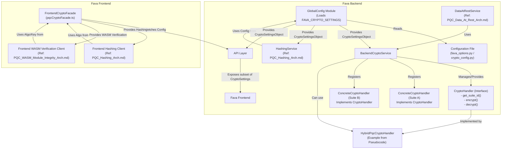
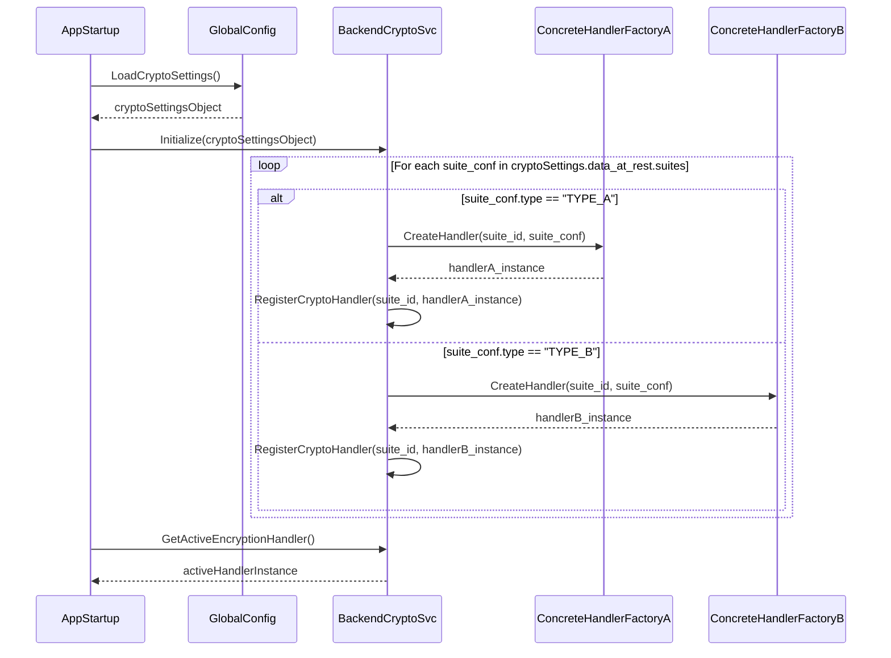
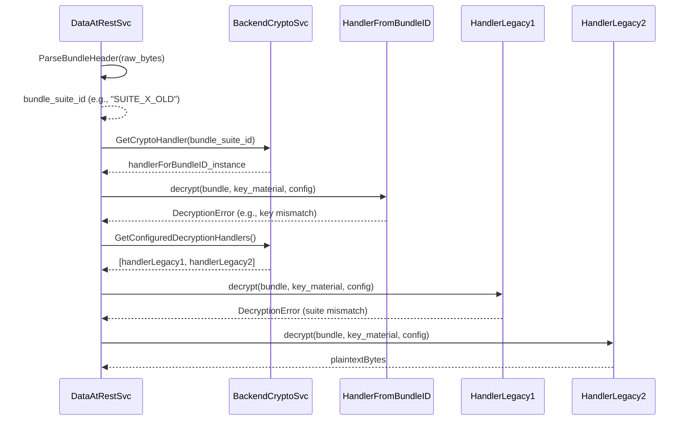
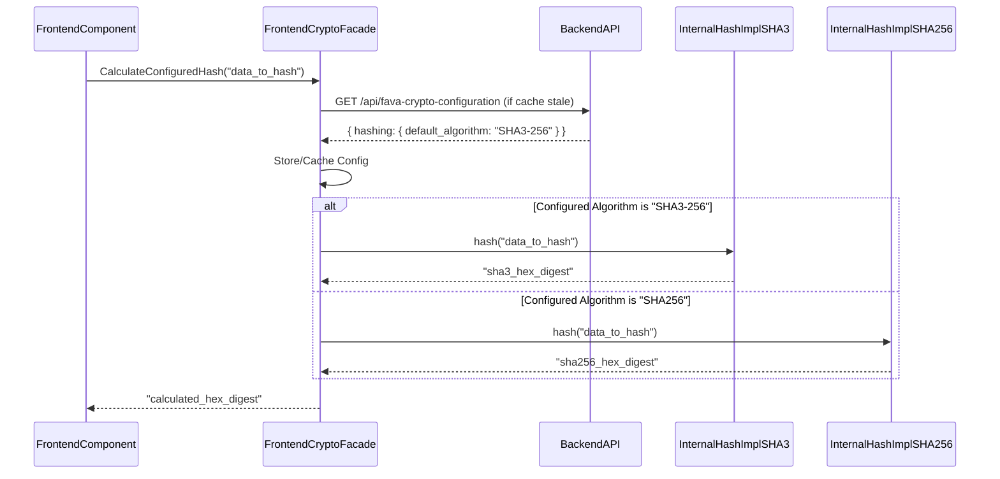

# PQC Cryptographic Agility Architecture for Fava

**Version:** 1.0
**Date:** 2025-06-02

**Based on:**
*   Specification: [`docs/specifications/PQC_Cryptographic_Agility_Spec.md`](../specifications/PQC_Cryptographic_Agility_Spec.md) (v1.1)
*   Pseudocode: [`docs/pseudocode/PQC_Cryptographic_Agility_Pseudo.md`](../pseudocode/PQC_Cryptographic_Agility_Pseudo.md) (v1.1)
*   Project Master Plan: [`docs/ProjectMasterPlan_PQC.md`](../ProjectMasterPlan_PQC.md) (v1.1, Task 3.5)
*   Acceptance Tests: [`tests/acceptance/PQC_Cryptographic_Agility_Acceptance_Tests.md`](../../tests/acceptance/PQC_Cryptographic_Agility_Acceptance_Tests.md) (v1.1)
*   Contextual Architectures:
    *   [`docs/architecture/PQC_Data_At_Rest_Arch.md`](./PQC_Data_At_Rest_Arch.md)
    *   [`docs/architecture/PQC_Hashing_Arch.md`](./PQC_Hashing_Arch.md)
    *   [`docs/architecture/PQC_WASM_Module_Integrity_Arch.md`](./PQC_WASM_Module_Integrity_Arch.md)

## 1. Introduction

This document details the high-level architecture for implementing cryptographic agility within the Fava application as part of its Post-Quantum Cryptography (PQC) upgrade. Cryptographic agility enables Fava to adapt to evolving cryptographic standards and algorithm choices primarily through configuration, minimizing code changes. This is crucial for addressing the dynamic PQC landscape and supporting transitions between classical, PQC, and hybrid cryptographic schemes.

This architecture defines system-wide patterns for:
*   A centralized configuration management system for cryptographic settings.
*   Service locator or factory patterns for instantiating cryptographic services with selected algorithms.
*   Metadata handling for associating algorithm information with data, particularly for data at rest.
*   Support for multiple decryption suites (active vs. legacy) for data at rest.

The architecture aims to realize the logic from the [`docs/pseudocode/PQC_Cryptographic_Agility_Pseudo.md`](../pseudocode/PQC_Cryptographic_Agility_Pseudo.md), meet the requirements of [`docs/specifications/PQC_Cryptographic_Agility_Spec.md`](../specifications/PQC_Cryptographic_Agility_Spec.md), support task 3.5 in the [`docs/ProjectMasterPlan_PQC.md`](../ProjectMasterPlan_PQC.md), and enable the passing of acceptance tests in [`tests/acceptance/PQC_Cryptographic_Agility_Acceptance_Tests.md`](../../tests/acceptance/PQC_Cryptographic_Agility_Acceptance_Tests.md).

## 2. Architectural Goals

Derived from [`docs/specifications/PQC_Cryptographic_Agility_Spec.md#2-functional-requirements`](../specifications/PQC_Cryptographic_Agility_Spec.md#2-functional-requirements) and [`docs/specifications/PQC_Cryptographic_Agility_Spec.md#3-non-functional-requirements`](../specifications/PQC_Cryptographic_Agility_Spec.md#3-non-functional-requirements):

*   **Configurability (FR2.3):** Allow administrators to specify cryptographic algorithms and parameters via Fava's configuration.
*   **Abstraction (FR2.1, FR2.2, FR2.8):** Isolate cryptographic logic in dedicated backend and frontend services, abstracting core application logic from specific algorithm implementations.
*   **Algorithm Switching (FR2.5):** Enable changing configured algorithms without core application code changes.
*   **Hybrid Support (FR2.6):** Explicitly support hybrid cryptographic schemes.
*   **Legacy Decryption (FR2.9):** Support decryption of data encrypted with older, configured cryptographic suites.
*   **Graceful Fallback/Error Handling (FR2.7):** Handle unavailable algorithms or misconfigurations securely and informatively.
*   **Security (NFR3.1):** Ensure the agility framework itself is secure and promotes secure defaults.
*   **Maintainability (NFR3.2):** Facilitate straightforward addition of new algorithms or suites.
*   **Testability (NFR3.3):** Design services for high testability, including algorithm switching.

## 3. Key Architectural Decisions (ADRs)

### ADR-AGL-001: Centralized Cryptographic Configuration (`FAVA_CRYPTO_SETTINGS`)

*   **Decision:** Adopt a centralized configuration structure, `FAVA_CRYPTO_SETTINGS` (as defined in [`docs/specifications/PQC_Cryptographic_Agility_Spec.md#81-cryptoservice-configuration-in-favaoptions-revised`](../specifications/PQC_Cryptographic_Agility_Spec.md#81-cryptoservice-configuration-in-favaoptions-revised)), to be managed within Fava's options system (e.g., `fava_options.py` or a dedicated `crypto_config.py`). A `GlobalConfig` module will be responsible for loading, validating, and caching these settings.
*   **Rationale:** Provides a single source of truth for all cryptographic algorithm choices and parameters (FR2.3). Simplifies management and auditing of crypto settings (NFR3.5). Aligns with [`docs/pseudocode/PQC_Cryptographic_Agility_Pseudo.md#1-global-configuration-management`](../pseudocode/PQC_Cryptographic_Agility_Pseudo.md#1-global-configuration-management).
*   **Consequences:** Requires a well-defined schema for `FAVA_CRYPTO_SETTINGS` and robust parsing/validation logic.

### ADR-AGL-002: Backend `BackendCryptoService` with Registry/Factory Pattern

*   **Decision:** Implement a central `BackendCryptoService` in the Fava backend (e.g., `fava.crypto_service`) that uses a registry and factory pattern to manage and provide `CryptoHandler` instances for different cryptographic suites.
*   **Rationale:** Abstracts cryptographic operations (FR2.1, FR2.8). Enables dynamic instantiation of handlers based on configuration (FR2.4, FR2.5). Supports registration of various handlers (hybrid, classical, etc.). Aligns with [`docs/pseudocode/PQC_Cryptographic_Agility_Pseudo.md#2-backend-cryptoservice-conceptual-favacrypto_servicepy`](../pseudocode/PQC_Cryptographic_Agility_Pseudo.md#2-backend-cryptoservice-conceptual-favacrypto_servicepy).
*   **Consequences:** Defines a clear `CryptoHandler` interface. Requires an initialization phase to register handlers based on `FAVA_CRYPTO_SETTINGS`.

### ADR-AGL-003: Frontend `FrontendCryptoFacade` and Configuration API

*   **Decision:** Implement a `FrontendCryptoFacade` (e.g., `frontend/src/lib/pqcCryptoFacade.ts`) for frontend cryptographic needs (hashing, WASM verification). This facade will fetch relevant cryptographic configuration from a backend API endpoint.
*   **Rationale:** Provides a consistent cryptographic abstraction for the frontend (FR2.2). Allows frontend algorithm choices to be driven by backend configuration, ensuring consistency (FR2.5). Aligns with [`docs/pseudocode/PQC_Cryptographic_Agility_Pseudo.md#3-frontend-cryptographic-abstraction-conceptual-frontendsrclibpqccryptofacadets`](../pseudocode/PQC_Cryptographic_Agility_Pseudo.md#3-frontend-cryptographic-abstraction-conceptual-frontendsrclibpqccryptofacadets) and [`docs/specifications/PQC_Cryptographic_Agility_Spec.md#ip124-api-for-frontend-configuration`](../specifications/PQC_Cryptographic_Agility_Spec.md#ip124-api-for-frontend-configuration).
*   **Consequences:** Requires a backend API endpoint to expose parts of `FAVA_CRYPTO_SETTINGS`. The frontend facade needs logic to fetch, cache, and interpret this configuration.

### ADR-AGL-004: Standardized Metadata for Encrypted Data (Suite ID in Bundles)

*   **Decision:** For Fava-driven data-at-rest encryption, the `HybridEncryptedBundle` (defined in [`docs/pseudocode/PQC_Cryptographic_Agility_Pseudo.md#88`](../pseudocode/PQC_Cryptographic_Agility_Pseudo.md#88) and [`docs/architecture/PQC_Data_At_Rest_Arch.md`](./PQC_Data_At_Rest_Arch.md)) will include a `suite_id_used` field.
*   **Rationale:** This metadata is crucial for cryptographic agility in decryption (FR2.9, C7.5 from spec). It allows the decryption logic to make a targeted attempt with the correct handler, improving efficiency and reliability.
*   Consequences: Encryption handlers must correctly populate this field. Decryption logic can leverage this for a primary attempt before trying other legacy suites.
*   Rigorous testing of the `suite_id_used` parsing mechanism from various bundle versions/states is essential. Furthermore, thorough testing MUST be conducted for the subsequent `BackendCryptoService.GetCryptoHandler(suite_id)` lookup and the initialization of the correct handler with its specific configuration from `FAVA_CRYPTO_SETTINGS.data_at_rest.suites[suite_id]`.

### ADR-AGL-005: Configurable Decryption Attempt Order for Data at Rest

*   **Decision:** The `FAVA_CRYPTO_SETTINGS.data_at_rest.decryption_attempt_order` list will dictate the sequence in which `CryptoHandler` instances are tried for decrypting data at rest.
*   **Rationale:** Supports seamless decryption of files encrypted with older, but still supported, cryptographic suites (FR2.9). Provides administrators control over fallback strategies. Aligns with [`docs/pseudocode/PQC_Cryptographic_Agility_Pseudo.md#161-186`](../pseudocode/PQC_Cryptographic_Agility_Pseudo.md#161-186) (`GetConfiguredDecryptionHandlers`) and [`docs/pseudocode/PQC_Cryptographic_Agility_Pseudo.md#428-481`](../pseudocode/PQC_Cryptographic_Agility_Pseudo.md#428-481) (`DecryptDataAtRestWithAgility`).
*   **Consequences:** The `BackendCryptoService` must provide handlers in this specified order. Decryption logic will iterate through these handlers.

## 4. High-Level Architecture

### 4.1. C4 Model: Level 1 - System Context

```mermaid
graph TD
    Admin[Fava Administrator] -- Configures --> FavaInstance[Fava Application]
    User[Fava User] -- Interacts with --> FavaInstance
    FavaInstance -- Uses --> ConfigSource[Configuration Source (e.g., fava_options.py)]
    FavaInstance -- Uses --> CryptoLibraries[Cryptographic Libraries (oqs-python, cryptography, liboqs-js, js-sha3)]
    FavaInstance -- Operates on --> UserData[User Data (Beancount files, WASM modules)]

    style FavaInstance fill:#lightblue,stroke:#333,stroke-width:2px
```

### 4.2. C4 Model: Level 2 - Container Diagram (Fava Application)

```mermaid
graph TD
    subgraph FavaApplication [Fava Application]
        FavaBackend[Fava Backend (Python/Flask)]
        FavaFrontend[Fava Frontend (JS/Svelte/WASM)]
    end

    ConfigSource[Configuration Source] -- Provides FAVA_CRYPTO_SETTINGS --> FavaBackend
    FavaBackend -- Serves UI & API --> FavaFrontend
    FavaBackend -- Uses --> BackendCryptoLibs[Backend Crypto Libraries (oqs-python, cryptography)]
    FavaFrontend -- Uses --> FrontendCryptoLibs[Frontend Crypto Libraries (liboqs-js, js-sha3)]
    FavaBackend -- Exposes Crypto Config via API --> FavaFrontend

    style FavaBackend fill:#cyan,stroke:#333,stroke-width:2px
    style FavaFrontend fill:#cyan,stroke:#333,stroke-width:2px
```

## 5. Component Diagram (C4 Model - Level 3 - Focus on Agility Components)



**Component Descriptions:**

*   **`GlobalConfig` Module (Backend):**
    *   Responsibilities: Loads, validates, caches, and provides access to `FAVA_CRYPTO_SETTINGS`.
    *   Key functions: `LoadCryptoSettings()`, `GetCryptoSettings()` (from pseudocode).
*   **`BackendCryptoService` (Backend):**
    *   Responsibilities: Manages a registry of `CryptoHandler` implementations. Provides handlers based on configuration (e.g., active encryption handler, ordered list of decryption handlers).
    *   Key functions: `RegisterCryptoHandler()`, `GetCryptoHandler()`, `GetActiveEncryptionHandler()`, `GetConfiguredDecryptionHandlers()` (from pseudocode).
*   **`CryptoHandler` (Interface - Backend):**
    *   Defines the contract for all cryptographic operation handlers (encryption, decryption, getting suite ID).
    *   Key methods: `get_suite_id()`, `encrypt()`, `decrypt()` (from pseudocode).
*   **Concrete `CryptoHandler` Implementations (Backend):** Specific classes (e.g., `HybridPqcCryptoHandler` from pseudocode) that implement the `CryptoHandler` interface for a particular cryptographic suite.
*   **`FrontendCryptoFacade` (Frontend):**
    *   Responsibilities: Fetches relevant crypto configuration from the backend API. Provides abstracted cryptographic functions (hashing, WASM verification) to other frontend components, selecting implementations based on the fetched configuration.
    *   Key functions: `_getFavaRuntimeCryptoOptions()`, `CalculateConfiguredHash()`, `VerifyWasmSignatureWithConfig()` (from pseudocode).
*   **Contextual Services (References to other Arch docs):**
    *   `DataAtRestService`: Consumes `BackendCryptoService` for encrypting/decrypting Beancount files. Leverages `suite_id_used` and `decryption_attempt_order`.
    *   `HashingService`: Configured via `GlobalConfig` for default algorithm selection.
    *   `FrontendWasmVerifyClient`: Configured via `FrontendCryptoFacade` for algorithm and public key.

## 6. Detailed Design of Agility Mechanisms

### 6.1. Configuration Management

*   **`FAVA_CRYPTO_SETTINGS` Structure:** As defined in [`docs/specifications/PQC_Cryptographic_Agility_Spec.md#81-cryptoservice-configuration-in-favaoptions-revised`](../specifications/PQC_Cryptographic_Agility_Spec.md#81-cryptoservice-configuration-in-favaoptions-revised). This structure is central to agility, containing:
    *   `data_at_rest.active_encryption_suite_id`: For new encryptions.
    *   `data_at_rest.decryption_attempt_order`: For trying multiple suites during decryption.
    *   `data_at_rest.suites`: Definitions for each supported suite, including algorithms.
    *   `hashing.default_algorithm`: For hashing operations.
    *   `wasm_integrity`: Settings for WASM verification.
*   **`GlobalConfig` Module:**
    *   Implements `LoadCryptoSettings()`: Reads the configuration (e.g., from `fava_options.py`), parses, validates its schema, and logs success/failure.
    *   Implements `GetCryptoSettings()`: Returns cached settings or loads them if not already cached.
    *   Handles errors gracefully (e.g., missing file, malformed content, schema validation failure) as per pseudocode.

*   **Configuration Clarity and Safety:** Given the comprehensive nature of `FAVA_CRYPTO_SETTINGS`, it is paramount to provide exceptionally clear documentation for all settings. Secure defaults MUST be established for all configurable cryptographic parameters to minimize risk. The system MUST validate the entire settings structure upon Fava's startup, as implemented by the `GlobalConfigModule`. Future consideration should be given to developing a UI or CLI tool to assist administrators in managing these complex settings, thereby mitigating potential misconfiguration risks.

### 6.2. Backend `BackendCryptoService`

*   **Handler Registration:**
    *   During application startup, after `GlobalConfig.LoadCryptoSettings()` succeeds.
    *   Iterates through `FAVA_CRYPTO_SETTINGS.data_at_rest.suites`.
    *   For each suite, a corresponding `CryptoHandler` instance (or a factory for it) is created, configured with its specific `suite_conf`.
    *   The handler/factory is registered with `BackendCryptoService.RegisterCryptoHandler(suite_id, handler_or_factory)`.
    *   This mechanism allows new suites to be added by defining them in configuration and providing a corresponding handler implementation.
*   **Handler Retrieval:**
    *   `GetCryptoHandler(suite_id)`: Retrieves a registered handler. If a factory was registered, it creates an instance, potentially passing suite-specific configuration. Throws `AlgorithmNotFoundError` if not found.
    *   `GetActiveEncryptionHandler()`: Reads `active_encryption_suite_id` from settings, then calls `GetCryptoHandler()`. Throws `ConfigurationError` or `CriticalConfigurationError` if issues arise.
    *   `GetConfiguredDecryptionHandlers()`: Reads `decryption_attempt_order` from settings. For each `suite_id` in the list, calls `GetCryptoHandler()` and adds valid handlers to a list, returned in the specified order. Skips and logs warnings for unresolvable suite IDs.
*   **`CryptoHandler` Interface:**
    *   `get_suite_id() -> String`: Returns the unique identifier of the suite the handler implements.
    *   `encrypt(plaintext: Bytes, key_material: Any, suite_specific_config: Dictionary) -> HybridEncryptedBundle`: Encrypts data. The output `HybridEncryptedBundle` includes `suite_id_used`.
    *   `decrypt(bundle: HybridEncryptedBundle, key_material: Any, suite_specific_config: Dictionary) -> Bytes`: Decrypts data.
*   **`HybridEncryptedBundle` Structure:**
    *   Defined in [`docs/pseudocode/PQC_Cryptographic_Agility_Pseudo.md#88-98`](../pseudocode/PQC_Cryptographic_Agility_Pseudo.md#88-98).
    *   Crucially contains `suite_id_used`, allowing targeted decryption attempts.

### 6.3. Frontend `FrontendCryptoFacade`

*   **Fetching Configuration:**
    *   `_getFavaRuntimeCryptoOptions()`: Fetches relevant sections of `FAVA_CRYPTO_SETTINGS` (e.g., `hashing`, `wasm_integrity`) from a dedicated backend API endpoint.
    *   Implements caching with TTL to reduce API calls.
    *   Handles API errors gracefully (e.g., return stale cache, default values, or throw).
*   **Algorithm Selection:**
    *   `CalculateConfiguredHash()`: Gets `hashing.default_algorithm` from fetched config. Calls an internal function (`_internalCalculateHash`) that switches implementation (e.g., SHA3-256 JS lib vs. WebCrypto SHA-256) based on the algorithm name. Includes fallback logic.
    *   `VerifyWasmSignatureWithConfig()`: Gets `wasm_integrity` settings (enabled flag, public key, algorithm name) from fetched config. Calls `_internalVerifySignature` which uses `liboqs-js` for the specified algorithm.

### 6.4. Data at Rest Agility

*   Integrates with [`docs/architecture/PQC_Data_At_Rest_Arch.md`](./PQC_Data_At_Rest_Arch.md). The `CryptoService` described there is an instance of this agility framework.
*   **Encryption:** `DataAtRestService` calls `BackendCryptoService.GetActiveEncryptionHandler()` to get the handler for the `active_encryption_suite_id`. The handler's `encrypt()` method produces a `HybridEncryptedBundle` containing the `suite_id_used`.
*   **Decryption (Function `DecryptDataAtRestWithAgility` from pseudocode):**
    1.  Attempt to parse a common bundle header from `raw_encrypted_bytes` to extract `suite_id_used` (C7.5 from spec).
    2.  If successful, attempt decryption with the handler for this `suite_id_used` first.
    3.  If parsing fails or the targeted attempt fails, retrieve the ordered list of handlers from `BackendCryptoService.GetConfiguredDecryptionHandlers()`.
    4.  Iterate through this list, attempting decryption with each handler until success or all handlers fail.
    5.  This supports [`tests/acceptance/PQC_Cryptographic_Agility_Acceptance_Tests.md#pqc_agl_002`](../../tests/acceptance/PQC_Cryptographic_Agility_Acceptance_Tests.md#pqc_agl_002).

### 6.5. Hashing Agility

*   Integrates with [`docs/architecture/PQC_Hashing_Arch.md`](./PQC_Hashing_Arch.md).
*   **Backend:** The `HashingService` (from Hashing Arch) is configured by `GlobalConfig.GetCryptoSettings().hashing.default_algorithm`.
*   **Frontend:** `FrontendCryptoFacade.CalculateConfiguredHash()` uses the algorithm name fetched from the API (originating from `FAVA_CRYPTO_SETTINGS.hashing.default_algorithm`).
*   This supports [`tests/acceptance/PQC_Cryptographic_Agility_Acceptance_Tests.md#pqc_agl_001`](../../tests/acceptance/PQC_Cryptographic_Agility_Acceptance_Tests.md#pqc_agl_001) and [`tests/acceptance/PQC_Cryptographic_Agility_Acceptance_Tests.md#pqc_agl_003`](../../tests/acceptance/PQC_Cryptographic_Agility_Acceptance_Tests.md#pqc_agl_003).

### 6.6. WASM Integrity Agility

*   Integrates with [`docs/architecture/PQC_WASM_Module_Integrity_Arch.md`](./PQC_WASM_Module_Integrity_Arch.md).
*   **Frontend:** `FrontendCryptoFacade.VerifyWasmSignatureWithConfig()` uses settings (enabled flag, public key, algorithm) fetched from the API (originating from `FAVA_CRYPTO_SETTINGS.wasm_integrity`). The `PqcVerificationService` (from WASM Arch) uses these settings.

## 7. Data Models (Key Agility Structures)

### 7.1. `FAVA_CRYPTO_SETTINGS`

(As defined in [`docs/specifications/PQC_Cryptographic_Agility_Spec.md#81-cryptoservice-configuration-in-favaoptions-revised`](../specifications/PQC_Cryptographic_Agility_Spec.md#81-cryptoservice-configuration-in-favaoptions-revised))

Key fields for agility:
*   `data_at_rest.active_encryption_suite_id`
*   `data_at_rest.decryption_attempt_order`
*   `data_at_rest.suites[suite_id].{classical_kem_algorithm, pqc_kem_algorithm, symmetric_algorithm, kdf_algorithm}`
*   `hashing.default_algorithm`
*   `wasm_integrity.{verification_enabled, public_key_dilithium3_base64, signature_algorithm}`

### 7.2. `HybridEncryptedBundle`

(As defined in [`docs/pseudocode/PQC_Cryptographic_Agility_Pseudo.md#88-98`](../pseudocode/PQC_Cryptographic_Agility_Pseudo.md#88-98))

Key field for agility:
*   `suite_id_used: String`

## 8. Sequence Diagrams (Illustrative)

### 8.1. Backend: Loading Crypto Settings & Registering Handlers (Application Startup)



### 8.2. Backend: Decrypting Data at Rest with Legacy Fallback



### 8.3. Frontend: Calculating Hash Based on Fetched Configuration



## 9. Alignment with Project Artifacts

### 9.1. Project Master Plan ([`docs/ProjectMasterPlan_PQC.md`](../ProjectMasterPlan_PQC.md))
*   This architecture directly addresses **Task 3.5: Design Architecture for Cryptographic Agility Mechanisms**.
*   It defines the configuration management system (`GlobalConfig`, `FAVA_CRYPTO_SETTINGS`), `BackendCryptoService` factory/registry patterns, metadata handling (`suite_id_used` in `HybridEncryptedBundle`), and support for multiple decryption suites (`decryption_attempt_order`).
*   The AI Verifiable End Result for Task 3.5 is the creation of this document.

### 9.2. Specifications ([`docs/specifications/PQC_Cryptographic_Agility_Spec.md`](../specifications/PQC_Cryptographic_Agility_Spec.md) v1.1)
*   **FR2.1 (Central CryptoService - Backend):** Implemented by `BackendCryptoService`.
*   **FR2.2 (Crypto Abstraction - Frontend):** Implemented by `FrontendCryptoFacade`.
*   **FR2.3 (Configurable Algorithms):** Managed by `GlobalConfig` and `FAVA_CRYPTO_SETTINGS`.
*   **FR2.4 (Service Registry/Factory):** Implemented within `BackendCryptoService`.
*   **FR2.5 (Algorithm Switching):** Core principle of this architecture.
*   **FR2.6 (Support for Hybrid Modes):** Handled by concrete `CryptoHandler` implementations like `HybridPqcCryptoHandler`.
*   **FR2.7 (Graceful Fallback/Error Handling):** Addressed in `GlobalConfig`, `BackendCryptoService`, and `FrontendCryptoFacade` logic.
*   **FR2.8 (Clear Separation of Concerns):** Achieved by dedicated services.
*   **FR2.9 (Support for Decrypting Older Formats):** Supported by `decryption_attempt_order` and `suite_id_used` metadata.
*   **Data Models (Spec Section 8.1):** `FAVA_CRYPTO_SETTINGS` is central.
*   **Integration Points (Spec Section 12):** This architecture defines how these points are realized.

### 9.3. Pseudocode ([`docs/pseudocode/PQC_Cryptographic_Agility_Pseudo.md`](../pseudocode/PQC_Cryptographic_Agility_Pseudo.md) v1.1)
*   The components `GlobalConfig`, `BackendCryptoService`, `CryptoHandler` interface, `HybridEncryptedBundle`, `FrontendCryptoFacade`, and the initialization flow directly map to the structures and functions defined in the pseudocode.
*   TDD anchors from pseudocode (e.g., `test_load_crypto_settings_...`, `test_get_crypto_handler_...`, `test_get_active_encryption_handler_...`, `test_fe_get_runtime_options_...`) are supported by the described component responsibilities and interactions.

### 9.4. Acceptance Tests ([`tests/acceptance/PQC_Cryptographic_Agility_Acceptance_Tests.md`](../../tests/acceptance/PQC_Cryptographic_Agility_Acceptance_Tests.md) v1.1)
This architecture is designed to enable passing these tests:
*   **PQC_AGL_001:** Backend hashing algorithm switching is supported by `GlobalConfig` and the `HashingService` (ref Hashing Arch) using the configured algorithm.
*   **PQC_AGL_002:** Backend PQC KEM suite switching and legacy decryption are supported by `BackendCryptoService`, `active_encryption_suite_id`, `decryption_attempt_order`, and `suite_id_used` in bundles.
*   **PQC_AGL_003:** Frontend hashing uses algorithm from backend config via `FrontendCryptoFacade` and the API.
*   **PQC_AGL_004:** Error handling for unknown/unsupported suites is part of `BackendCryptoService`'s handler retrieval logic and `GlobalConfig`'s validation.

## 10. Security Considerations for Agility

*   **Configuration Integrity:** The `FAVA_CRYPTO_SETTINGS` source must be protected from unauthorized modification. If an attacker can change these settings, they can weaken or bypass cryptographic protections.
*   **Algorithm Validation:** The `GlobalConfig` module must validate that configured algorithms are known and supported. The `BackendCryptoService` must ensure that handlers for configured suites can be loaded and are functional (e.g., required libraries are present).
*   **Secure Defaults:** Default `FAVA_CRYPTO_SETTINGS` should prioritize strong, PQC-resistant algorithms.
*   **Complexity Management:** While agility is beneficial, managing many cryptographic suites and their configurations can increase complexity and the potential for misconfiguration. Clear documentation and admin UI are important.
*   **Key Management Agility:** This architecture focuses on algorithm agility. Key management practices must also be adaptable if underlying key types or derivation methods change with new suites.

## 11. Performance Considerations for Agility

*   **Configuration Loading:** `GlobalConfig.LoadCryptoSettings()` involves file I/O and parsing. Caching (as per pseudocode) mitigates repeated overhead.
*   **Handler Instantiation:** Factory patterns might add a small overhead for creating handler instances, but this is likely negligible compared to cryptographic operations.
*   **Decryption Iteration:** Iterating through `decryption_attempt_order` can add latency if the correct suite is late in the list. The targeted attempt using `suite_id_used` from the bundle header significantly mitigates this for most cases.
*   **Frontend Config Fetch:** API calls by `FrontendCryptoFacade` to fetch configuration add network latency. Caching with TTL is essential.

## 12. Future Considerations

*   **Adding New Algorithms/Suites:** The registry pattern in `BackendCryptoService` and the structure of `FAVA_CRYPTO_SETTINGS` are designed to make adding new suites relatively straightforward: define the suite in config, implement a new `CryptoHandler`, and register it.
*   **Automated Migration Tools:** For data at rest, if users need to re-encrypt data from an old suite to a new active suite, a separate utility or Fava feature could be developed. This architecture provides the building blocks (decryption with old, encryption with new).
*   **Dynamic Library Loading:** For very advanced scenarios, handlers could attempt to dynamically load cryptographic libraries if not statically linked, though this adds complexity.
*   Enhanced Configuration Validation: More sophisticated validation rules for suite parameter compatibility could be added to `GlobalConfig`.
*   **Advanced Key Management Agility:** While the current `CryptoHandler` interface and `KeyMaterialForEncryption/Decryption` structures support agility for algorithms with similar key material paradigms, truly novel keying requirements in future cryptographic suites (e.g., fundamentally different key types or `key_material` structures) might necessitate changes to these interfaces or structures themselves. For enhanced long-term maintainability and adaptability, future iterations could explore making the `CryptoHandler` interface more descriptive about the *nature* or *schema* of the key material it expects. This could allow key management logic to be more dynamically adaptive or provide better error reporting for mismatched key material, further extending "config-only" agility.

