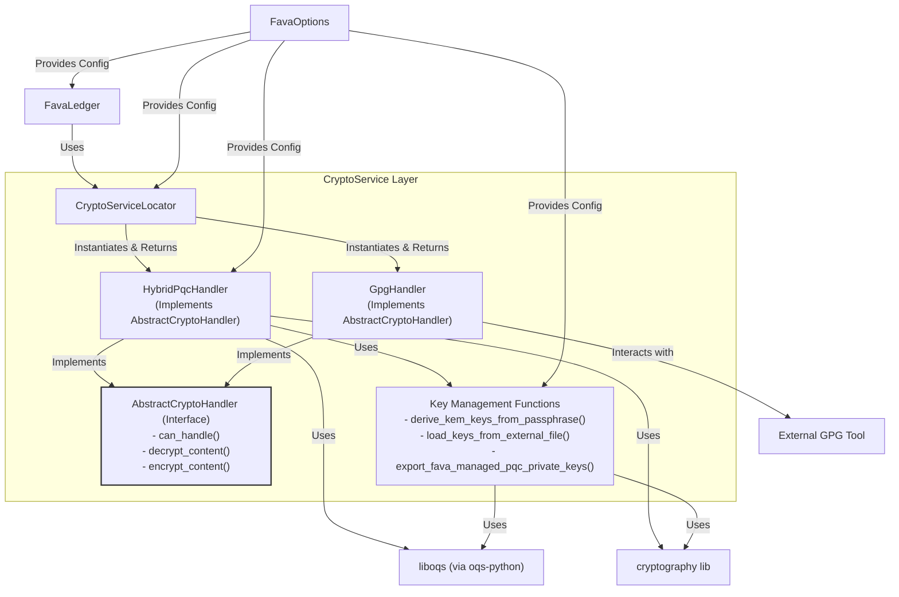
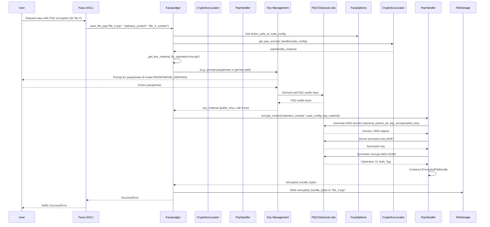
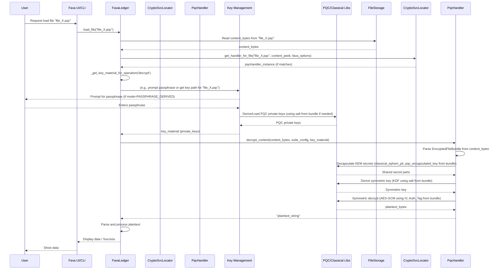
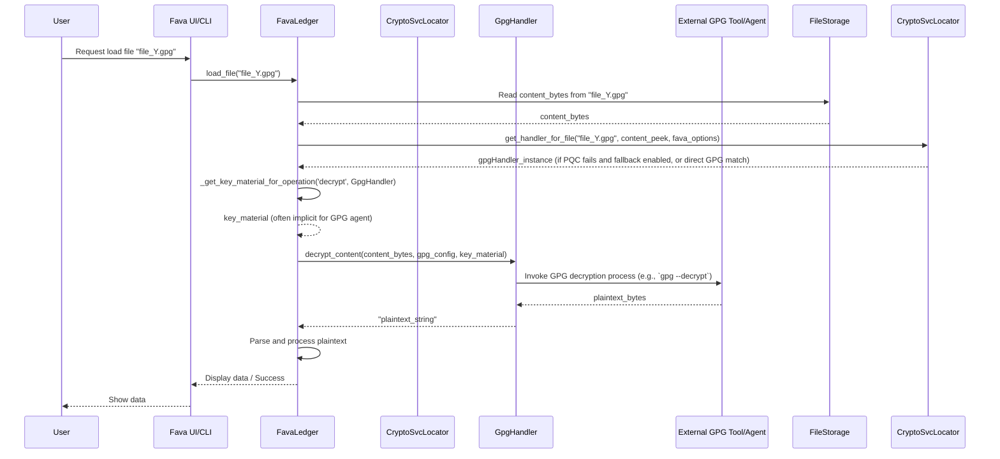

# PQC Data at Rest Architecture for Fava

**Version:** 1.0
**Date:** 2025-06-02
**Based on:**
*   Specification: [`docs/specifications/PQC_Data_At_Rest_Spec.md`](../../docs/specifications/PQC_Data_At_Rest_Spec.md) (v1.1)
*   Pseudocode: [`docs/pseudocode/PQC_Data_At_Rest_Pseudo.md`](../../docs/pseudocode/PQC_Data_At_Rest_Pseudo.md) (v1.0)
*   Project Master Plan: [`docs/ProjectMasterPlan_PQC.md`](../../docs/ProjectMasterPlan_PQC.md) (v1.1, Task 3.1)
*   Acceptance Tests: [`tests/acceptance/PQC_Data_At_Rest_Acceptance_Tests.md`](../../../tests/acceptance/PQC_Data_At_Rest_Acceptance_Tests.md) (v1.1)

## 1. Introduction

This document details the high-level architecture for integrating Post-Quantum Cryptography (PQC) for data at rest within the Fava application. It focuses on the encryption and decryption of Beancount files using a hybrid PQC scheme and classical GPG, ensuring backward compatibility and future-proofing against quantum threats.

The architecture introduces a `CryptoService` layer responsible for abstracting cryptographic operations, allowing for flexibility and cryptographic agility.

## 2. Architectural Goals

*   **Security:** Provide robust protection for Beancount files at rest against both classical and quantum adversaries.
*   **Backward Compatibility:** Continue to support existing GPG-encrypted files seamlessly.
*   **Usability:** Enable Fava-driven PQC encryption and decryption with a user-friendly experience, especially regarding key management.
*   **Maintainability & Agility:** Design a modular system that allows for easy updates to cryptographic algorithms and configurations.
*   **Performance:** Ensure PQC operations meet the performance NFRs defined in the specifications.
*   **Clarity:** Provide a clear architectural blueprint for developers.

## 3. Key Architectural Decisions (ADRs)

### ADR-001: Centralized CryptoService Layer

*   **Decision:** Introduce a dedicated `CryptoService` layer to handle all cryptographic operations for data at rest. This layer will include a `CryptoServiceLocator` to select appropriate handlers (`HybridPqcHandler`, `GpgHandler`) based on file type or configuration.
*   **Rationale:**
    *   Promotes separation of concerns, decoupling cryptographic logic from core Fava business logic (`FavaLedger`).
    *   Enhances cryptographic agility (NFR3.7), making it easier to add, update, or switch crypto algorithms.
    *   Centralizes crypto-related configuration and error handling.
    *   Aligns with pseudocode design ([`docs/pseudocode/PQC_Data_At_Rest_Pseudo.md#7-cryptoservicelocator`](../../docs/pseudocode/PQC_Data_At_Rest_Pseudo.md#7-cryptoservicelocator)).
*   **Consequences:** Requires modifications to `FavaLedger` to delegate crypto operations. Introduces new components for handlers and the locator.

### ADR-002: Fava-Driven Hybrid PQC Encryption

*   **Decision:** Implement Fava-driven PQC hybrid encryption (X25519 + ML-KEM-768 + AES-256-GCM by default) as a primary feature, not just relying on external tools.
*   **Rationale:**
    *   Addresses FR2.5 and improves user experience (US4.1, US4.6) by providing an integrated solution.
    *   Reduces dependency on external PQC tooling for GPG, which is not yet mature ([`docs/research/final_report/01_executive_summary_PART_1.md`](../../docs/research/final_report/01_executive_summary_PART_1.md)).
    *   Allows Fava to manage the `EncryptedFileBundle` format consistently.
*   **Consequences:** Increases complexity within Fava, requiring robust key management and implementation of the hybrid encryption scheme.

### ADR-003: Key Management Strategy

*   **Decision:** Support two primary key management modes for Fava-PQC-Hybrid:
    1.  `PASSPHRASE_DERIVED`: Derive PQC KEM keys from a user-provided passphrase. This involves first stretching the passphrase using a strong Password-Based Key Derivation Function (PBKDF) like **Argon2id**, and then using the output of Argon2id as Input Keying Material (IKM) for a Key Derivation Function (KDF) like HKDF-SHA3-512 to derive the specific classical and PQC KEM keys.
    2.  `EXTERNAL_KEY_FILE`: Allow users to specify paths to externally managed PQC key files.
*   **Rationale:**
    *   Provides flexibility for users (FR2.5.2, C7.3).
    *   Passphrase derivation, when combined with a strong PBKDF like Argon2id, significantly enhances security against low-entropy passphrases before deriving cryptographic keys with HKDF. This makes the feature more robust and user-friendly.
    *   External files cater to advanced users or specific key management policies.
    *   Aligns with pseudocode ([`docs/pseudocode/PQC_Data_At_Rest_Pseudo.md#5-key-management-functions`](../../docs/pseudocode/PQC_Data_At_Rest_Pseudo.md#5-key-management-functions)), with the architectural clarification of using Argon2id prior to the KDF specified there.
*   **Consequences:** Requires careful implementation of secure PBKDF (Argon2id) and KDF (HKDF) processes, including proper salt management for Argon2id. User education on passphrase strength, while still important, is supplemented by the protection Argon2id offers. Handling of key file paths remains critical.

### ADR-004: Standardized Encrypted File Bundle

*   **Decision:** Adopt the `EncryptedFileBundle` structure as defined in the pseudocode ([`docs/pseudocode/PQC_Data_At_Rest_Pseudo.md#3-data-structures`](../../docs/pseudocode/PQC_Data_At_Rest_Pseudo.md#3-data-structures)) for Fava-PQC-Hybrid encrypted files.
*   **Rationale:**
    *   Ensures all necessary metadata for decryption (suite ID, KEM outputs, IVs, tags, salts) is stored with the file (NFR3.5.1).
    *   Provides a versioned format (`FAVA_PQC_HYBRID_V1`) for future evolution.
*   **Consequences:** Requires serialization/deserialization logic for this bundle format.

### ADR-005: Security of PQC Private Key Export

*   **Decision:** Implement the PQC private key export feature (FR2.9: `export_fava_managed_pqc_private_keys()`) with stringent security measures and clear user warnings.
*   **Rationale:**
    *   While providing user flexibility for backups or use with external tools, exporting raw PQC private keys carries significant security risks if the exported key is mishandled, lost, or stolen.
    *   The feature must be designed to minimize these risks as much as possible.
*   **Consequences:**
    *   The export process MUST be heavily guarded (e.g., require re-authentication, explicit multi-step user confirmation for the specific key being exported).
    *   Users MUST be presented with clear, prominent, and understandable warnings about the severe risks of exporting and mishandling private keys before proceeding with the export.
    *   The export format MUST be secure by default (e.g., encrypted using a strong, user-provided passphrase with a standard-compliant method like PKCS#8 encryption or a well-defined secure container format) and clearly documented. Unencrypted export, if offered at all, must require additional explicit confirmation and warnings.
    *   Consideration should be given to making this feature opt-in through configuration or deferring it from the initial core release due to its sensitivity and the complexity of implementing it with robust security. If implemented, it must be treated with the highest security priority during development and testing.
    *   Logging for export events should be comprehensive but avoid leaking sensitive details.

## 4. System Context (C4 Level 1)

```mermaid
graph TD
    User[User] -- Interacts via UI/CLI --> FavaApp[Fava Application]
    FavaApp -- Loads/Saves --> BeancountFileStore[Beancount File Storage]
    FavaApp -- Uses --> PQCryptoLib[PQC Crypto Libraries (oqs-python)]
    FavaApp -- Uses --> ClassicalCryptoLib[Classical Crypto Libraries (cryptography)]
    FavaApp -- Optionally interacts with --> GPGTool[GPG Tool/Agent]

    subgraph Fava Application
        FavaCore[Fava Core Logic (FavaLedger, Web UI, API)]
        CryptoServiceLayer[CryptoService Layer]
    end

    FavaCore -- Delegates Crypto Ops --> CryptoServiceLayer
    CryptoServiceLayer -- Uses --> PQCryptoLib
    CryptoServiceLayer -- Uses --> ClassicalCryptoLib
    CryptoServiceLayer -- Interacts for GPG --> GPGTool
    FavaCore -- Reads/Writes --> BeancountFileStore
```

*   **User:** Interacts with Fava to manage and view Beancount data.
*   **Fava Application:** The main Fava system.
    *   **Fava Core Logic:** Existing components responsible for parsing, processing, and displaying Beancount data.
    *   **CryptoService Layer:** New layer responsible for encryption and decryption.
*   **Beancount File Storage:** Where encrypted and plaintext Beancount files are stored.
*   **PQC Crypto Libraries:** External libraries like `oqs-python` providing PQC primitives.
*   **Classical Crypto Libraries:** Libraries like `cryptography` for AES, X25519, KDFs.
*   **GPG Tool/Agent:** External GPG system used for classical GPG operations.

## 5. Container Diagram (C4 Level 2 - Focus on Crypto Integration)

```mermaid
graph TD
    FavaWebUI[Fava Web UI/CLI] -- Requests File Load/Save --> FavaLedger[FavaLedger]
    FavaLedger -- Uses --> FavaOptions[FavaOptions (PQC Config)]
    FavaLedger -- Delegates Crypto --> CryptoServiceLocator[CryptoServiceLocator]
    CryptoServiceLocator -- Selects Handler --> PqcHybridHandler[HybridPqcHandler]
    CryptoServiceLocator -- Selects Handler --> GpgHandler[GpgHandler]

    PqcHybridHandler -- Uses --> KeyManagement[Key Management Module]
    PqcHybridHandler -- Uses --> OQS_Python[oqs-python]
    PqcHybridHandler -- Uses --> CryptographyLib[cryptography lib]
    GpgHandler -- Interacts with --> GPG_CLI[GPG CLI/Agent]

    KeyManagement -- Derives/Loads Keys --> UserInput[User Input (Passphrase/Key Path)]
    KeyManagement -- Reads/Writes Salts --> BeancountFileStore[Beancount File Storage (Metadata in Bundle)]

    PqcHybridHandler -- Reads/Writes --> EncryptedFileBundle[EncryptedFileBundle (on File Storage)]
    GpgHandler -- Reads/Writes --> GPGEncryptedFile[GPG Encrypted File (on File Storage)]
    FavaLedger -- Parses/Processes --> PlaintextData[Plaintext Beancount Data]

    style FavaLedger fill:#lightgrey,stroke:#333,stroke-width:2px
    style CryptoServiceLocator fill:#lightblue,stroke:#333,stroke-width:2px
    style PqcHybridHandler fill:#lightblue,stroke:#333,stroke-width:2px
    style GpgHandler fill:#lightblue,stroke:#333,stroke-width:2px
    style KeyManagement fill:#lightblue,stroke:#333,stroke-width:2px
```

*   **Fava Web UI/CLI:** User interface for Fava.
*   **FavaLedger:** Core component in Fava, responsible for loading and managing Beancount data. Modified to interact with the `CryptoServiceLocator`.
*   **FavaOptions:** Provides PQC configuration settings to `FavaLedger` and `CryptoService` components.
*   **CryptoServiceLocator:** Determines which cryptographic handler to use for a given file or operation.
*   **HybridPqcHandler:** Handles encryption and decryption using the PQC hybrid scheme.
*   **GpgHandler:** Handles decryption of GPG-encrypted files.
*   **Key Management Module:** Contains logic for deriving keys from passphrases or loading them from files.
*   **oqs-python / cryptography lib:** External libraries providing cryptographic primitives.
*   **GPG CLI/Agent:** External GPG tool.
*   **EncryptedFileBundle / GPGEncryptedFile:** Representations of encrypted files on storage.

## 6. Component Diagram (C4 Level 3 - CryptoService Layer)



*   **FavaLedger:** Interacts with the `CryptoServiceLocator` to get appropriate handlers.
*   **FavaOptions:** Provides configuration to various crypto components.
*   **CryptoServiceLocator:**
    *   Responsibilities: Based on configuration, file extension, or file content (magic bytes), selects and returns an instance of a concrete `AbstractCryptoHandler`.
    *   Key methods: `get_handler_for_file()`, `get_pqc_encrypt_handler()`.
*   **AbstractCryptoHandler (Interface):**
    *   Defines the contract for all crypto handlers.
    *   Methods: `can_handle()`, `decrypt_content()`, `encrypt_content()`.
*   **HybridPqcHandler:**
    *   Responsibilities: Implements the Fava-PQC-Hybrid encryption and decryption logic (X25519 + ML-KEM-768 + AES-256-GCM). Manages the `EncryptedFileBundle`.
    *   Dependencies: `KeyManagementFunctions`, `oqs-python`, `cryptography`.
*   **GpgHandler:**
    *   Responsibilities: Implements decryption for GPG-encrypted files by interacting with the system's GPG tool. Encryption via Fava is typically not supported for GPG in this PQC context.
    *   Dependencies: External GPG tool.
*   **Key Management Functions:**
    *   Responsibilities: Securely derive KEM key pairs from passphrases, load keys from external files, and handle key export.
    *   Functions: `derive_kem_keys_from_passphrase()`, `load_keys_from_external_file()`, `export_fava_managed_pqc_private_keys()`.
    *   Dependencies: `oqs-python`, `cryptography`.

## 7. Core Components Details

### 7.1. `CryptoServiceLocator`
*   **Purpose:** To decouple `FavaLedger` from specific crypto implementations and to select the appropriate handler based on file characteristics or explicit requests.
*   **Key Logic:**
    *   Maintains a list of registered `AbstractCryptoHandler` instances (e.g., `HybridPqcHandler`, `GpgHandler`).
    *   `get_handler_for_file(file_path, content_bytes_peek, fava_options)`: Iterates through handlers, calling `can_handle()` on each. Returns the first matching handler. Implements fallback logic (e.g., to GPG if `pqc_fallback_to_classical_gpg` is true).
    *   `get_pqc_encrypt_handler(suite_config, fava_options)`: Returns a configured `HybridPqcHandler` instance for encryption based on the active PQC suite.
*   **Alignment:** Directly implements [`docs/pseudocode/PQC_Data_At_Rest_Pseudo.md#7-cryptoservicelocator`](../../docs/pseudocode/PQC_Data_At_Rest_Pseudo.md#7-cryptoservicelocator).

### 7.2. `AbstractCryptoHandler` Interface
*   **Purpose:** Defines a common interface for all cryptographic handlers.
*   **Methods:**
    *   `can_handle(file_path: str, content_bytes_peek: Optional[bytes], config: Dict) -> bool`: Determines if the handler can process the given file.
    *   `decrypt_content(encrypted_content_bundle: bytes, suite_config: Dict, key_material: Any) -> str`: Decrypts content. Raises `DecryptionError`, `MissingDependencyError`.
    *   `encrypt_content(plaintext_content: str, suite_config: Dict, key_material: Any) -> bytes`: Encrypts content. Raises `EncryptionError`, `MissingDependencyError`.
*   **Alignment:** Matches [`docs/pseudocode/PQC_Data_At_Rest_Pseudo.md#6-crypto-handlers`](../../docs/pseudocode/PQC_Data_At_Rest_Pseudo.md#6-crypto-handlers) and [`docs/specifications/PQC_Data_At_Rest_Spec.md#101-cryptoservice-decryptionencryption-interface-backend`](../../docs/specifications/PQC_Data_At_Rest_Spec.md#101-cryptoservice-decryptionencryption-interface-backend).

### 7.3. `HybridPqcHandler`
*   **Purpose:** Implements the hybrid PQC encryption (X25519 + ML-KEM-768 KEMs, AES-256-GCM symmetric) and decryption.
*   **Key Logic (Encryption):**
    1.  Obtain recipient's classical and PQC public keys from `key_material`.
    2.  Perform classical KEM (e.g., X25519: generate ephemeral key pair, perform DH or KEM encapsulate).
    3.  Perform PQC KEM (e.g., ML-KEM-768: encapsulate to get shared secret part and ciphertext).
    4.  Combine classical and PQC shared secret parts.
    5.  Derive symmetric key using KDF (e.g., HKDF-SHA3-512) from combined secrets and a salt.
    6.  Encrypt plaintext with AES-256-GCM using derived key and a new IV.
    7.  Construct and serialize `EncryptedFileBundle`.
*   **Key Logic (Decryption):**
    1.  Parse `EncryptedFileBundle`.
    2.  Verify format identifier and suite ID.
    3.  Obtain recipient's classical and PQC private keys from `key_material`.
    4.  Perform classical KEM decapsulation using ephemeral public key from bundle.
    5.  Perform PQC KEM decapsulation using PQC encapsulated key from bundle.
    6.  Combine shared secret parts.
    7.  Derive symmetric key using KDF and salt from bundle.
    8.  Decrypt ciphertext with AES-256-GCM, verifying authentication tag.
*   **Alignment:** Implements logic from [`docs/pseudocode/PQC_Data_At_Rest_Pseudo.md#CLASS-HybridPqcHandler`](../../docs/pseudocode/PQC_Data_At_Rest_Pseudo.md#CLASS-HybridPqcHandler).

### 7.4. `GpgHandler`
*   **Purpose:** Provides backward compatibility for decrypting GPG-encrypted files.
*   **Key Logic (Decryption):**
    *   `can_handle()`: Checks for `.gpg` extension or GPG magic bytes.
    *   `decrypt_content()`: Invokes the system's GPG tool (e.g., `gpg --decrypt`) or uses a GPG library to decrypt the provided content. Key material is often managed by the GPG agent.
*   **Key Logic (Encryption):** Typically raises `NotImplementedError` as Fava-driven encryption focuses on the PQC hybrid scheme.
*   **Alignment:** Implements logic from [`docs/pseudocode/PQC_Data_At_Rest_Pseudo.md#CLASS-GpgHandler`](../../docs/pseudocode/PQC_Data_At_Rest_Pseudo.md#CLASS-GpgHandler).

### 7.5. Key Management Module/Functions
*   **Purpose:** To securely manage cryptographic keys required for PQC operations.
*   **Functions:**
    *   `derive_kem_keys_from_passphrase(passphrase, salt, pbkdf_alg, kdf_alg_for_ikm, classical_kem_spec, pqc_kem_spec)`: Derives classical and PQC KEM key pairs from a passphrase. This involves first stretching the passphrase using a strong PBKDF (e.g., Argon2id, specified by `pbkdf_alg`) with the provided `salt`. The output of the PBKDF is then used as Input Keying Material (IKM) for a KDF (e.g., HKDF-SHA3-512, specified by `kdf_alg_for_ikm`) to derive the actual KEM keys. The `salt` provided is for the PBKDF step and must be unique and random per derivation.
    *   `load_keys_from_external_file(key_file_path_config)`: Loads KEM key pairs from specified file(s).
    *   `export_fava_managed_pqc_private_keys(key_context, export_format)`: Exports Fava-managed PQC private keys. **Refer to ADR-005 for critical security considerations regarding this function.**
*   **Security:** Critical to use strong PBKDFs (like Argon2id) for passphrase stretching and strong KDFs (like HKDF) for subsequent key derivation. Appropriate salt management for the PBKDF is paramount: the salt must be unique per encryption instance, sufficiently random, and securely stored (typically within the `EncryptedFileBundle`). Secure handling of all key material is essential.
*   **Alignment:** Implements functions from [`docs/pseudocode/PQC_Data_At_Rest_Pseudo.md#5-key-management-functions`](../../docs/pseudocode/PQC_Data_At_Rest_Pseudo.md#5-key-management-functions), with the architectural clarification of the PBKDF (Argon2id) + KDF (HKDF) sequence for passphrase-derived keys.

### 7.6. `FavaLedger` Modifications
*   **Purpose:** Integrate the new `CryptoService` layer into Fava's core file loading and saving logic.
*   **Key Methods (Conceptual):**
    *   `_get_key_material_for_operation(fava_options, file_context, operation_type, handler_type_hint)`: Retrieves or derives necessary key material (public keys for encryption, private keys for decryption) based on `fava_options` (key management mode, source detail) and user interaction (e.g., passphrase prompt).
    *   `_try_decrypt_content(file_path, content_bytes)`:
        1.  Uses `CryptoServiceLocator` to get a handler.
        2.  If handler found, calls `_get_key_material_for_operation()`.
        3.  Calls `handler.decrypt_content()`.
        4.  Handles errors and logging.
    *   `save_file_pqc(output_file_path, content_str, original_file_context)`:
        1.  Checks if PQC encryption is enabled.
        2.  Gets active PQC suite config from `fava_options`.
        3.  Uses `CryptoServiceLocator` to get a `HybridPqcHandler`.
        4.  Calls `_get_key_material_for_operation()` for encryption keys.
        5.  Calls `handler.encrypt_content()`.
        6.  Writes encrypted bundle to file.
        7.  Handles errors and logging.
*   **Alignment:** Integrates concepts from [`docs/pseudocode/PQC_Data_At_Rest_Pseudo.md#8-favaledger-integration-conceptual-stubs`](../../docs/pseudocode/PQC_Data_At_Rest_Pseudo.md#8-favaledger-integration-conceptual-stubs).

## 8. Data Models

### 8.1. PQC Configuration Parameters
As defined in [`docs/specifications/PQC_Data_At_Rest_Spec.md#81-pqc-configuration-parameters-conceptual`](../../docs/specifications/PQC_Data_At_Rest_Spec.md#81-pqc-configuration-parameters-conceptual) and [`docs/pseudocode/PQC_Data_At_Rest_Pseudo.md#2-global-configuration-constants-conceptual---from-fava-options`](../../docs/pseudocode/PQC_Data_At_Rest_Pseudo.md#2-global-configuration-constants-conceptual---from-fava-options). These will be managed within Fava's existing options system.
*   `CONFIG_PQC_DATA_AT_REST_ENABLED`: BOOLEAN
*   `CONFIG_PQC_ACTIVE_SUITE_ID`: STRING
*   `CONFIG_PQC_SUITES`: MAP<STRING, PQCSuiteDefinition>
*   `CONFIG_PQC_KEY_MANAGEMENT_MODE`: STRING ("PASSPHRASE_DERIVED", "EXTERNAL_KEY_FILE")
*   `CONFIG_PQC_KEY_SOURCE_DETAIL`: STRING (e.g., salt, key file path)
*   `CONFIG_PQC_FALLBACK_TO_GPG`: BOOLEAN

    ```
    STRUCTURE PQCSuiteDefinition:
        description: STRING
        classical_kem_algorithm: STRING (e.g., "X25519")
        pqc_kem_algorithm: STRING (e.g., "ML-KEM-768")
        symmetric_algorithm: STRING (e.g., "AES256GCM")
        kdf_algorithm_for_hybrid_sk: STRING (e.g., "HKDF-SHA3-512") // For deriving symmetric key from KEM outputs
        pbkdf_algorithm_for_passphrase: STRING (e.g., "Argon2id") // PBKDF for stretching passphrase
        kdf_algorithm_for_passphrase_ikm: STRING (e.g., "HKDF-SHA3-512") // KDF for deriving KEM keys from PBKDF output
    ```

### 8.2. `EncryptedFileBundle`
As defined in [`docs/specifications/PQC_Data_At_Rest_Spec.md#82-encrypted-file-metadata-conceptual-for-fava-pqc-hybrid-encrypted-files`](../../docs/specifications/PQC_Data_At_Rest_Spec.md#82-encrypted-file-metadata-conceptual-for-fava-pqc-hybrid-encrypted-files) and [`docs/pseudocode/PQC_Data_At_Rest_Pseudo.md#3-data-structures`](../../docs/pseudocode/PQC_Data_At_Rest_Pseudo.md#3-data-structures). This structure is serialized to bytes and forms the content of Fava-PQC-Hybrid encrypted files.

```
STRUCTURE EncryptedFileBundle:
    format_identifier: STRING (e.g., "FAVA_PQC_HYBRID_V1")
    suite_id: STRING
    classical_kem_ephemeral_public_key: BYTES (OPTIONAL)
    pqc_kem_encapsulated_key: BYTES
    symmetric_cipher_iv_or_nonce: BYTES
    encrypted_data_ciphertext: BYTES
    authentication_tag: BYTES
    pbkdf_salt_for_passphrase_derivation: BYTES (OPTIONAL, salt for the PBKDF like Argon2id if KEM keys were derived from passphrase. Must be unique and random per instance.)
    kdf_salt_for_hybrid_sk_derivation: BYTES (OPTIONAL, salt for KDF deriving symmetric key from KEM outputs, if used)
```

## 9. Sequence Diagrams

### 9.1. PQC Hybrid Encryption Flow



### 9.2. PQC Hybrid Decryption Flow



### 9.3. GPG Decryption Flow (Fallback Example)



## 10. Data Flow Diagrams

### 10.1. PQC Hybrid Encryption Data Flow

```mermaid
graph TD
    A[Plaintext Beancount Data] --> B(HybridPqcHandler.encrypt_content)
    C[User Passphrase/Key File Path] --> D(KeyManagement.derive/load_keys)
    D -- Salt (if passphrase derived for Argon2id) --> B
    D --> E[PQC Public Keys]
    E --> B
    F[FavaOptions: Active Suite Config] --> B
    B --> G{KEM Encapsulation (Classical + PQC)}
    G --> H[Combined Shared Secret]
    H --> I{KDF for Symmetric Key}
    I --> J[Symmetric Key (AES-256-GCM)]
    A --> K{Symmetric Encryption}
    J --> K
    K --> L[Ciphertext, IV, Auth Tag]
    B -- Collects Metadata --> M(EncryptedFileBundle Construction)
    G -- KEM Outputs --> M
    L -- Ciphertext etc. --> M
    D -- PBKDF Salt (if passphrase derived) --> M
    M --> N[Serialized EncryptedFileBundle (Bytes)]
    N --> O[File Storage (.pqc_hybrid_fava)]
```

### 10.2. PQC Hybrid Decryption Data Flow

```mermaid
graph TD
    P[File Storage (.pqc_hybrid_fava)] --> Q[Serialized EncryptedFileBundle (Bytes)]
    Q --> R(HybridPqcHandler.decrypt_content)
    S[User Passphrase/Key File Path] --> T(KeyManagement.derive/load_keys)
    R -- Bundle PBKDF Salt --> T
    T --> U[PQC Private Keys]
    U --> R
    V[FavaOptions: Suite Config from Bundle] --> R
    R -- Parses Bundle --> W{KEM Decapsulation (Classical + PQC)}
    W -- Uses PQC Private Keys & Bundle KEM Data --> X[Combined Shared Secret]
    X -- Uses Bundle Salt --> Y{KDF for Symmetric Key}
    Y --> Z[Symmetric Key (AES-256-GCM)]
    R -- Bundle Ciphertext, IV, Auth Tag --> AA{Symmetric Decryption}
    Z --> AA
    AA --> AB[Plaintext Beancount Data]
```

## 11. Interfaces

Refer to Component Diagram (Section 6) and Core Component Details (Section 7) for detailed method signatures. Key interfaces include:
*   **`AbstractCryptoHandler`:** `can_handle()`, `decrypt_content()`, `encrypt_content()`.
*   **`CryptoServiceLocator`:** `get_handler_for_file()`, `get_pqc_encrypt_handler()`.
*   **Key Management Functions:** `derive_kem_keys_from_passphrase()`, `load_keys_from_external_file()`, `export_fava_managed_pqc_private_keys()`.
*   **`FavaLedger` (New/Modified Methods):** `_get_key_material_for_operation()`, `_try_decrypt_content()`, `save_file_pqc()`.

## 12. Alignment with Project Artifacts

### 12.1. Project Master Plan ([`docs/ProjectMasterPlan_PQC.md`](../../docs/ProjectMasterPlan_PQC.md))
*   This architecture directly addresses **Task 3.1: Design Architecture for PQC Data at Rest Integration**.
*   It defines the `CryptoService` (Sections 5, 6, 7), details interaction with classical GPG (`GpgHandler`), identifies new components (`CryptoServiceLocator`, `HybridPqcHandler`, `KeyManagement`), outlines modifications to `FavaLedger`, and illustrates data flow and interfaces through diagrams.
*   The AI Verifiable End Result for Task 3.1 is the creation of this document.

### 12.2. Specifications ([`docs/specifications/PQC_Data_At_Rest_Spec.md`](../../docs/specifications/PQC_Data_At_Rest_Spec.md) v1.1)
*   **FR2.1 (Hybrid Decryption):** Supported by `HybridPqcHandler` using X25519, ML-KEM-768, AES-256-GCM.
*   **FR2.2 (GPG Decryption):** Supported by `GpgHandler`.
*   **FR2.3 (Configurable Algorithms):** `FavaOptions` provides suite definitions, used by handlers.
*   **FR2.4 (Core Logic on Decrypted Data):** `FavaLedger` receives plaintext from handlers, enabling existing core logic.
*   **FR2.5 (Fava-Driven Encryption):** `HybridPqcHandler.encrypt_content()` and `FavaLedger.save_file_pqc()` implement this.
*   **FR2.5.1 (UI/CLI for Encryption):** `FavaLedger.save_file_pqc()` is the backend for this.
*   **FR2.5.2 (Key Management):** `KeyManagementFunctions` and `FavaLedger._get_key_material_for_operation()` handle this.
*   **FR2.6 (Indication of Encryption Type):** `CryptoServiceLocator.get_handler_for_file()` can provide this info; UI can use it.
*   **FR2.7 (Error Messages):** Handlers and `FavaLedger` are designed to raise/propagate specific errors.
*   **FR2.8 (Sound Key Derivation):** `KeyManagementFunctions` use a strong PBKDF (Argon2id) for passphrase stretching, followed by a KDF (HKDF-SHA3-512) for key derivation, as detailed in this architecture.
*   **FR2.9 (Key Export):** `KeyManagementFunctions.export_fava_managed_pqc_private_keys()`. The implementation of this feature must adhere to the security guidelines outlined in ADR-005.
*   **NFR3.1 (Security):** Adherence to standards is via library choices (`oqs-python`, `cryptography`), hybrid scheme construction, and robust key derivation practices (Argon2id + HKDF).
*   **NFR3.2 (Performance):** Addressed in Section 14.
*   **NFR3.6 (Maintainability - CryptoService):** Central to this architecture.
*   **NFR3.7 (Cryptographic Agility):** Supported by `CryptoServiceLocator` and configurable suites.
*   **Data Models (Section 8 in Spec):** Directly adopted in Section 8 of this document.

### 12.3. Pseudocode ([`docs/pseudocode/PQC_Data_At_Rest_Pseudo.md`](../../docs/pseudocode/PQC_Data_At_Rest_Pseudo.md) v1.0)
*   The components `CryptoServiceLocator`, `AbstractCryptoHandler`, `HybridPqcHandler`, `GpgHandler`, `KeyManagementFunctions`, and `FavaLedger` modifications directly map to the structures and functions defined in the pseudocode.
*   The `EncryptedFileBundle` and configuration constants are also directly adopted.
*   Sequence diagrams (Section 9) visualize the pseudocode flows.

### 12.4. High-Level Acceptance Tests ([`tests/acceptance/PQC_Data_At_Rest_Acceptance_Tests.md`](../../../tests/acceptance/PQC_Data_At_Rest_Acceptance_Tests.md) v1.1)
This architecture is designed to enable passing these tests:
*   **PQC_DAR_001, PQC_DAR_002, PQC_DAR_004, PQC_DAR_005:** Test the `HybridPqcHandler` decryption logic, key handling, and error reporting via `FavaLedger`.
*   **PQC_DAR_003:** Tests the `GpgHandler` and `CryptoServiceLocator` fallback/selection logic.
*   **PQC_DAR_006:** Tests the `HybridPqcHandler` encryption logic and `FavaLedger.save_file_pqc()`.
*   **PQC_DAR_007:** Tests `KeyManagementFunctions.derive_kem_keys_from_passphrase()` via the encryption/decryption flow.
*   Logging requirements in AVERs will be met by adding appropriate log statements in `FavaLedger` and handlers.

## 13. Security Considerations

*   **Key Management:** This is the most critical aspect.
    *   **Passphrase-Based Key Derivation:** For the `PASSPHRASE_DERIVED` key management mode, it is crucial to use a strong Password-Based Key Derivation Function (PBKDF) like **Argon2id** to stretch the user's passphrase. The output of Argon2id is then used as the Input Keying Material (IKM) for a subsequent Key Derivation Function (KDF) like HKDF-SHA3-512 to derive the specific classical and PQC KEM keys. This significantly mitigates risks associated with low-entropy passphrases.
    *   Passphrases must be handled securely (e.g., not logged, zeroized after use).
    *   **Salt Management:** Salts for passphrase derivation (specifically for the PBKDF like Argon2id) must be unique per encryption instance, sufficiently random (cryptographically secure PRNG), and securely stored, typically within the `EncryptedFileBundle` as `pbkdf_salt_for_passphrase_derivation`.
    *   External key files: Fava should only store paths; securing the files themselves is the user's responsibility.
    *   **Key Export:** The `export_fava_managed_pqc_private_keys` feature (FR2.9) is a high-risk operation. Refer to **ADR-005** for detailed security requirements. It must be protected with multiple confirmations, clearly warn users about the implications of exposing private keys, and use a secure, documented export format (preferably encrypted).
*   **Library Dependencies:** Rely on well-vetted libraries (`oqs-python`, `cryptography`). Keep them updated.
*   **Algorithm Choice:** Default to NIST-recommended PQC algorithms (ML-KEM-768) and strong classical algorithms (X25519, AES-256-GCM, HKDF-SHA3-512).
*   **Side-Channel Attacks:** While harder to mitigate at this architectural level, be mindful of cryptographic operations that might be vulnerable, especially in key derivation or handling. Rely on library implementations to mitigate these where possible.
*   **Error Handling:** Ensure errors do not leak sensitive information.
*   **EncryptedFileBundle Integrity:** The AEAD (AES-GCM) provides integrity for the encrypted data. The overall bundle structure itself is not separately signed but relies on the AEAD of the payload.

## 14. Performance Considerations

*   **NFR3.2 Targets:**
    *   Decryption (1MB file): 200-500ms.
    *   Encryption (1MB file): 200-600ms.
*   **Potential Bottlenecks:**
    *   PQC KEM operations (especially key generation if done per encryption, though for KEMs it's often encapsulation/decapsulation that's more frequent). `oqs-python` calls involve C library overhead.
    *   KDF operations if iterations are very high (though HKDF is generally efficient).
    *   File I/O for reading/writing encrypted bundles.
*   **Mitigation/Approach:**
    *   Leverage efficient library implementations.
    *   Profile key cryptographic paths during development.
    *   For passphrase derivation, key derivation is done once per operation (on-demand).
    *   The hybrid scheme (X25519 + ML-KEM-768) is chosen for a balance of classical and quantum security with reasonable performance based on research.
    *   Acceptance tests (PQC_DAR_001, PQC_DAR_006) include AVERs for capturing decryption/encryption time, which will be monitored against NFRs.

## 15. Future Considerations/Potential Issues

*   **Key Storage/Caching:** The current pseudocode implies on-demand key derivation/loading. For improved UX (fewer passphrase prompts), secure key caching (e.g., in memory for a session, OS keychain integration) could be considered in the future, but adds significant security complexity. This architecture does not preclude it but focuses on the core on-demand model first.
*   **Algorithm Updates:** As NIST finalizes more PQC standards or recommends changes, the cryptographic agility provided by the `CryptoService` and configurable suites will be crucial for updates.
*   **External Tool Interoperability:** While the `EncryptedFileBundle` is Fava-specific, documenting its format (NFR3.5.1) is important if external tools wish to interoperate.
*   **User Experience for Key Management:** Clear guidance and intuitive UI/CLI interactions will be vital, especially for passphrase management and external key file selection.
*   **Dependency Management:** Ensuring `oqs-python` and `cryptography` are correctly installed and compatible across user environments can be challenging. Packaging and installation scripts will need to handle this.