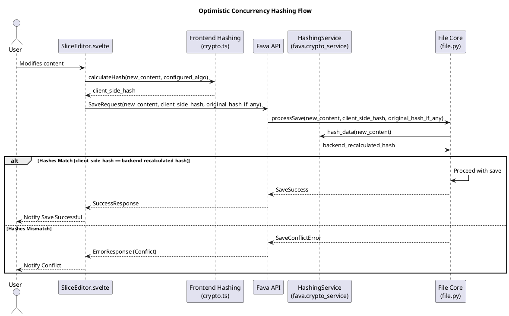
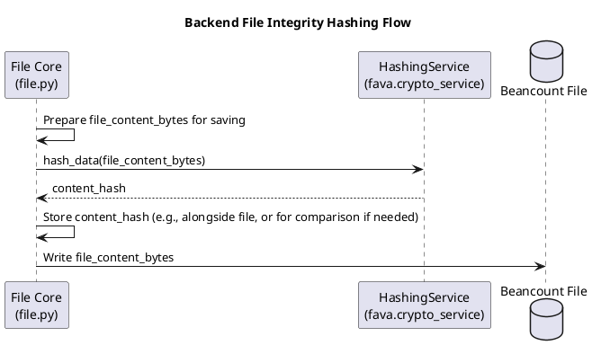

# PQC Hashing Integration Architecture for Fava

**Version:** 1.1
**Date:** 2025-06-02

## 1. Introduction

This document outlines the high-level architecture for integrating Post-Quantum Cryptography (PQC) resilient hashing mechanisms into Fava. The primary goal is to enhance long-term data integrity against potential quantum threats by adopting SHA3-256 as the default hashing algorithm, while maintaining support for SHA-256.

This architecture is based on:
*   **Specifications:** [`docs/specifications/PQC_Hashing_Spec.md`](../specifications/PQC_Hashing_Spec.md) (Version 1.1)
*   **Pseudocode:** [`docs/pseudocode/PQC_Hashing_Pseudo.md`](../pseudocode/PQC_Hashing_Pseudo.md) (Version 1.0)
*   **Project Master Plan:** [`docs/ProjectMasterPlan_PQC.md`](../ProjectMasterPlan_PQC.md) (Version 1.1), specifically Task 3.3 ([`docs/ProjectMasterPlan_PQC.md:97-100`](../ProjectMasterPlan_PQC.md:97))
*   **High-Level Acceptance Tests:** [`tests/acceptance/PQC_Hashing_Acceptance_Tests.md`](../../tests/acceptance/PQC_Hashing_Acceptance_Tests.md) (Version 1.1)

The architecture defines how hashing services will be abstracted and implemented in both the Fava backend and frontend, how algorithm selection will be managed, and which modules will be impacted.

## 2. Architectural Goals

The PQC hashing architecture aims to achieve the following, derived from the Non-Functional Requirements in [`docs/specifications/PQC_Hashing_Spec.md#3-non-functional-requirements`](../specifications/PQC_Hashing_Spec.md#3-non-functional-requirements):

*   **Security (NFR3.1):** Ensure correct implementation of chosen hash algorithms (SHA3-256, SHA-256).
*   **Performance (NFR3.2):** Meet performance targets for backend and frontend hashing operations.
*   **Usability (Admin, NFR3.3):** Allow straightforward configuration of the hashing algorithm.
*   **Reliability (NFR3.4):** Ensure consistent and reliable hash outputs for the same input.
*   **Maintainability (NFR3.5):** Design abstraction layers to easily support new hash algorithms in the future.
*   **Cryptographic Agility (NFR3.6):** Allow easy switching between configured hash algorithms.
*   **Frontend Bundle Size (NFR3.7):** Minimize the impact of any new frontend hashing libraries on bundle size.

## 3. Key Architectural Decisions (ADRs)

### ADR-1: Centralized Backend Hashing Service

*   **Decision:** A dedicated `HashingService` will be implemented in the Fava backend, likely within a new `fava.crypto_service` module as suggested in [`docs/pseudocode/PQC_Hashing_Pseudo.md#30`](../pseudocode/PQC_Hashing_Pseudo.md#30).
*   **Rationale:** Centralizes hashing logic, promotes code reuse, simplifies algorithm management and updates, and aligns with the cryptographic agility goal ([`docs/specifications/PQC_Hashing_Spec.md#nfr36`](../specifications/PQC_Hashing_Spec.md#nfr36)). This service will be responsible for selecting and applying the configured hash algorithm.
*   **Consequences:** Existing backend modules requiring hashing will need to be refactored to use this service.

### ADR-2: Frontend Hashing Abstraction

*   **Decision:** A frontend hashing abstraction will be implemented, likely in `frontend/src/lib/crypto.ts` as per [`docs/pseudocode/PQC_Hashing_Pseudo.md#170`](../pseudocode/PQC_Hashing_Pseudo.md#170).
*   **Rationale:** Provides a consistent interface for hashing operations in the frontend, isolates dependencies on specific JavaScript hashing libraries, and allows for algorithm selection based on backend configuration.
*   **Consequences:** Frontend components performing hashing (e.g., `SliceEditor.svelte`) will use this abstraction. A JavaScript library for SHA3-256 will be required ([`docs/specifications/PQC_Hashing_Spec.md#c72`](../specifications/PQC_Hashing_Spec.md#c72)).

### ADR-3: Default and Supported Algorithms

*   **Decision:** SHA3-256 will be the default hashing algorithm. SHA-256 will be supported as a configurable alternative.
*   **Rationale:** Aligns with [`docs/specifications/PQC_Hashing_Spec.md#fr22`](../specifications/PQC_Hashing_Spec.md#fr22) and [`docs/specifications/PQC_Hashing_Spec.md#fr23`](../specifications/PQC_Hashing_Spec.md#fr23) for enhanced long-term security and backward compatibility.
*   **Consequences:** Both backend and frontend services must implement logic to handle these two algorithms.

### ADR-4: Algorithm Configuration and Propagation

*   **Decision:** The hashing algorithm will be configured via Fava options (e.g., `pqc_hashing_algorithm` as per [`docs/specifications/PQC_Hashing_Spec.md#81-hashing-configuration-parameters`](../specifications/PQC_Hashing_Spec.md#81-hashing-configuration-parameters)). This configuration will be passed to the backend `HashingService` during initialization and exposed to the frontend via an API endpoint.
*   **Rationale:** Provides a single source of truth for algorithm selection ([`docs/specifications/PQC_Hashing_Spec.md#fr26`](../specifications/PQC_Hashing_Spec.md#fr26)) and enables cryptographic agility.
*   **Consequences:** Requires a new Fava option and an API endpoint modification or creation.

### ADR-5: Library Choices

*   **Decision (Backend):** Python's built-in `hashlib` will be preferred for SHA3-256 (Python >= 3.6) and SHA-256. A fallback library like `pysha3` will be used for SHA3-256 if `hashlib` does not support it ([`docs/specifications/PQC_Hashing_Spec.md#c71`](../specifications/PQC_Hashing_Spec.md#c71)).
*   **Decision (Frontend):** A JavaScript library (e.g., `js-sha3` or a similar WASM-based solution) will be used for SHA3-256, as `window.crypto.subtle` does not support it ([`docs/specifications/PQC_Hashing_Spec.md#c72`](../specifications/PQC_Hashing_Spec.md#c72)). `window.crypto.subtle` will be used for SHA-256. The selection of the specific SHA3-256 library (JavaScript or WASM-based) will be preceded by **mandated early benchmarking during the Refinement phase.** This benchmarking must explicitly verify compliance with NFR3.2 (Frontend Performance) and NFR3.7 (Frontend Bundle Size). The evaluation should also consider whether a WASM implementation offers a superior performance-to-bundle-size trade-off.
*   **Rationale:** Utilizes standard libraries where possible and ensures functionality across environments. **Mandating early benchmarking for frontend SHA3 libraries directly addresses NFR3.2 (Frontend Performance) and NFR3.7 (Frontend Bundle Size), ensuring informed library selection.** This proactive approach mitigates risks associated with performance bottlenecks or excessive bundle bloat from third-party dependencies.
*   **Consequences:** Potential new dependency for `pysha3` (backend) and a JS/WASM SHA3 library (frontend). **The Refinement phase will include a dedicated task for benchmarking and selecting the frontend SHA3 library.**

## 4. High-Level Architecture

The PQC hashing integration will introduce new services and modify existing components to utilize these services.

```plantuml
@startuml
!include https://raw.githubusercontent.com/plantuml-stdlib/C4-PlantUML/master/C4_Container.puml

LAYOUT_WITH_LEGEND()

Person(user, "Fava User/Admin")

System_Boundary(fava_system, "Fava Application") {
    Container(fava_frontend, "Fava Frontend", "JavaScript, Svelte", "User Interface for Beancount data, including editor")
    Container(fava_backend, "Fava Backend", "Python, Flask", "Core logic, API, file operations") {
        Component(fava_options, "Fava Options", "Configuration Management")
        Component(crypto_service, "HashingService", "fava.crypto_service", "Provides PQC hashing (SHA3-256, SHA256)")
        Component(file_core, "File Core", "src/fava/core/file.py", "Handles Beancount file operations")
        Component(api_layer, "API Layer", "src/fava/json_api.py", "Exposes Fava functionality and settings")
    }
}

ContainerDb(beancount_files, "Beancount Files", "File System", "User's financial data files")

Rel(user, fava_frontend, "Uses")
Rel(fava_frontend, fava_backend, "Makes API calls to", "HTTPS/JSON")

Rel(fava_options, crypto_service, "Provides 'pqc_hashing_algorithm' config")
Rel(file_core, crypto_service, "Uses for file integrity hashing")
Rel(fava_backend, beancount_files, "Reads/Writes")

Rel(api_layer, fava_options, "Reads 'pqc_hashing_algorithm' config")
Rel(fava_frontend, api_layer, "Fetches 'pqc_hashing_algorithm' config")

' Frontend specific components (conceptual within fava_frontend)
package "Fava Frontend Components" {
  Component(slice_editor, "SliceEditor.svelte", "Frontend Editor Component")
  Component(frontend_crypto, "Frontend Hashing", "frontend/src/lib/crypto.ts", "Provides client-side hashing")
}
Rel(slice_editor, frontend_crypto, "Uses for optimistic concurrency hashing")
Rel(frontend_crypto, api_layer, "Fetches 'pqc_hashing_algorithm' from backend via API call")

@enduml
```

**Key Components & Interactions:**

*   **Fava User/Admin:** Interacts with the Fava frontend and configures Fava options.
*   **Fava Frontend (`fava_frontend`):**
    *   **`Frontend Hashing` (`frontend/src/lib/crypto.ts`):** A new abstraction layer responsible for client-side hashing. It will fetch the configured `pqc_hashing_algorithm` from the backend API.
    *   **`SliceEditor.svelte`:** Will utilize the `Frontend Hashing` abstraction for calculating hashes for optimistic concurrency control ([`docs/specifications/PQC_Hashing_Spec.md#fr25`](../specifications/PQC_Hashing_Spec.md#fr25)).
*   **Fava Backend (`fava_backend`):**
    *   **`Fava Options`:** Stores the `pqc_hashing_algorithm` configuration setting.
    *   **`API Layer` ([`src/fava/json_api.py`](../../src/fava/json_api.py) or similar):** Exposes an endpoint (e.g., `/api/fava/settings` or a dedicated `/api/crypto/config`) to provide the `pqc_hashing_algorithm` to the frontend, as detailed in [`docs/pseudocode/PQC_Hashing_Pseudo.md#285`](../pseudocode/PQC_Hashing_Pseudo.md#285).
    *   **`HashingService` (`fava.crypto_service`):** A new service initialized with the `pqc_hashing_algorithm` from `Fava Options`. It provides a consistent interface for all backend hashing needs.
    *   **`File Core` ([`src/fava/core/file.py`](../../src/fava/core/file.py)):** Will use the `HashingService` for file integrity checks upon saving Beancount files ([`docs/specifications/PQC_Hashing_Spec.md#fr24`](../specifications/PQC_Hashing_Spec.md#fr24)).
*   **Beancount Files:** Data source/sink for Fava.

## 5. Detailed Component Design

### 5.1. Backend `HashingService` (in `fava.crypto_service`)

*   **Responsibilities:**
    *   Initialize based on the `pqc_hashing_algorithm` string from Fava configuration.
    *   Normalize algorithm names (e.g., "sha256", "SHA-256" to an internal standard like "SHA256").
    *   Provide a primary method: `hash_data(data: bytes) -> str` which returns a hex digest.
    *   Implement hashing logic for SHA3-256, attempting `hashlib` first, then `pysha3` as a fallback if `hashlib.sha3_256` is unavailable. Log fallback usage.
    *   Implement hashing logic for SHA-256 using `hashlib`.
    *   Handle unsupported configured algorithms by logging a warning and defaulting to SHA3-256 (as per [`docs/pseudocode/PQC_Hashing_Pseudo.md#70-73`](../pseudocode/PQC_Hashing_Pseudo.md#70)).
    *   Provide a method to get the currently configured algorithm name: `get_configured_algorithm_name() -> str`.
*   **Interface (Python-like):**
    ```python
    # In fava.crypto_service.py (conceptual)
    class HashingService:
        def __init__(self, configured_algorithm_name: str | None):
            # ... initialization logic as per pseudocode ...
            # self.algorithm_name_internal: str
            pass

        def hash_data(self, data: bytes) -> str:
            # ... hashing logic for SHA3-256 (with fallback) and SHA256 ...
            # ... error handling for unavailable algorithms ...
            pass

        def get_configured_algorithm_name(self) -> str:
            return self.algorithm_name_internal

    def get_hashing_service(fava_config_provider) -> HashingService:
        # ... logic to get algo from config and instantiate HashingService ...
        pass
    ```
*   **Interaction:**
    *   Instantiated once or per request cycle, receiving configuration from `FavaOptions` (via a provider/accessor).
    *   Used by modules like [`src/fava/core/file.py`](../../src/fava/core/file.py).

### 5.2. Frontend Hashing Abstraction (in `frontend/src/lib/crypto.ts`)

*   **Responsibilities:**
    *   Provide an asynchronous method: `async calculateHash(data_string: string, algorithm_name_from_config: string): Promise<string>`.
    *   Encode `data_string` to UTF-8 bytes before hashing.
    *   Select hashing implementation based on `algorithm_name_from_config`:
        *   For "SHA3-256": Use a JavaScript SHA3 library (e.g., `js-sha3`). Handle library availability and errors.
        *   For "SHA-256" (or normalized "SHA256"): Use `window.crypto.subtle.digest("SHA-256", ...)`.
    *   Handle unsupported or misconfigured `algorithm_name_from_config` by logging a warning and defaulting (e.g., to SHA-256 if SHA3 library is unavailable, or as per pseudocode logic [`docs/pseudocode/PQC_Hashing_Pseudo.md#216-224`](../pseudocode/PQC_Hashing_Pseudo.md#216)).
    *   Return the hash digest as a hexadecimal string.
*   **Interface (TypeScript-like):**
    ```typescript
    // In frontend/src/lib/crypto.ts (conceptual)
    export async function calculateHash(
      data_string: string,
      algorithm_name_from_config: string
    ): Promise<string> {
      // ... logic as per pseudocode ...
      // ... TextEncoder, SHA3 JS lib usage, WebCrypto usage ...
      // ... error handling and logging ...
    }

    // Helper to fetch config (conceptual, might be part of a larger config service)
    async function fetchHashingConfigAlgorithm(): Promise<string> {
        // const response = await fetch('/api/crypto/config'); // Or general settings endpoint
        // const config = await response.json();
        // return config.hashing_algorithm || "SHA3-256"; // Default if API fails
        return "SHA3-256"; // Placeholder
    }
    ```
*   **Interaction:**
    *   The `algorithm_name_from_config` is typically fetched once on frontend initialization or when needed from the backend API.
    *   Used by components like `SliceEditor.svelte` for optimistic concurrency.

### 5.3. Configuration Management

*   **Fava Option:** A new option, `pqc_hashing_algorithm: str`, will be added to Fava's configuration system.
    *   Default value: `"SHA3-256"`.
    *   Accepted values: `"SHA3-256"`, `"SHA256"` (case-insensitive matching is advisable).
*   **Backend Propagation:** The `HashingService` will be initialized using the value of this option.
*   **Frontend Propagation:** An API endpoint (e.g., as part of `/api/fava/settings` or a new `/api/crypto/config`) will expose the *exact string value* of `pqc_hashing_algorithm` as configured in the backend. The frontend `calculateHash` function will then interpret this string. This ensures consistency as per [`docs/specifications/PQC_Hashing_Spec.md#fr26`](../specifications/PQC_Hashing_Spec.md#fr26).

## 6. Data Flow Examples

### 6.1. Optimistic Concurrency Check (Frontend Editor Save)


This flow aligns with Use Case 5.2 in [`docs/specifications/PQC_Hashing_Spec.md#52-use-case-frontend-optimistic-concurrency-check-with-configured-sha3-256-hash`](../specifications/PQC_Hashing_Spec.md#52-use-case-frontend-optimistic-concurrency-check-with-configured-sha3-256-hash).

### 6.2. Backend File Integrity Check (File Save)


This flow aligns with Use Case 5.1 in [`docs/specifications/PQC_Hashing_Spec.md#51-use-case-backend-file-integrity-check-with-configured-sha3-256-hash`](../specifications/PQC_Hashing_Spec.md#51-use-case-backend-file-integrity-check-with-configured-sha3-256-hash).

## 7. Algorithm Selection and Management

*   The primary driver for algorithm selection is the `pqc_hashing_algorithm` Fava option.
*   **Backend `HashingService`:**
    *   Reads the configured algorithm string during initialization.
    *   Normalizes it (e.g., "sHa3-256" -> "SHA3-256", "sha-256" -> "SHA256").
    *   If the normalized algorithm is "SHA3-256", it uses the SHA3-256 implementation (with Python `hashlib` or `pysha3` fallback).
    *   If "SHA256", it uses the SHA-256 implementation (Python `hashlib`).
    *   If unsupported, logs a warning and defaults to "SHA3-256" as per pseudocode ([`docs/pseudocode/PQC_Hashing_Pseudo.md#70-73`](../pseudocode/PQC_Hashing_Pseudo.md#70)).
*   **Frontend `calculateHash` function:**
    *   Receives the algorithm string (e.g., "SHA3-256", "SHA256") fetched from the backend API.
    *   Normalizes it for internal use (e.g., "SHA256" to "SHA-256" for WebCrypto compatibility).
    *   If "SHA3-256", uses the JS SHA3 library. If the library is unavailable, it logs an error and may throw an exception or fallback as defined in [`docs/pseudocode/PQC_Hashing_Pseudo.md#232-235`](../pseudocode/PQC_Hashing_Pseudo.md#232).
    *   If "SHA-256" (normalized), uses `window.crypto.subtle`.
    *   If unsupported, logs a warning and defaults according to the logic in [`docs/pseudocode/PQC_Hashing_Pseudo.md#216-224`](../pseudocode/PQC_Hashing_Pseudo.md#216) (e.g., prefer SHA3-256 if available, else SHA-256).

## 8. Modules Requiring PQC Hashing

Based on [`docs/specifications/PQC_Hashing_Spec.md#1-introduction`](../specifications/PQC_Hashing_Spec.md#1-introduction), the primary Fava modules impacted are:

*   **Backend:**
    *   [`src/fava/core/file.py`](../../src/fava/core/file.py): For file integrity checks when saving Beancount files. This module will need to call the new `HashingService`.
    *   The backend component handling the save operation from the `SliceEditor` will also use the `HashingService` to re-calculate and verify the hash provided by the frontend for optimistic concurrency.
*   **Frontend:**
    *   [`frontend/src/editor/SliceEditor.svelte`](../../frontend/src/editor/SliceEditor.svelte): For calculating client-side hashes of file slices to support optimistic concurrency. This will use the new frontend hashing abstraction in `frontend/src/lib/crypto.ts`.
*   **Configuration & API:**
    *   Fava's configuration loading mechanism ([`src/fava/core/fava_options.py`](../../src/fava/core/fava_options.py) or equivalent) needs to support the new `pqc_hashing_algorithm` option.
    *   Fava's API layer ([`src/fava/json_api.py`](../../src/fava/json_api.py) or equivalent) needs to expose this configuration to the frontend.

## 9. Alignment with Project Artifacts

*   **Project Master Plan ([`docs/ProjectMasterPlan_PQC.md`](../ProjectMasterPlan_PQC.md)):** This architecture directly addresses Task 3.3: "Design Architecture for PQC Hashing Integration" ([`docs/ProjectMasterPlan_PQC.md:97-100`](../ProjectMasterPlan_PQC.md:97)). The AVER for that task is the creation of this document.
*   **Specifications ([`docs/specifications/PQC_Hashing_Spec.md`](../specifications/PQC_Hashing_Spec.md)):**
    *   Implements FR2.1 (abstraction layers `HashingService` and `frontend/src/lib/crypto.ts`).
    *   Supports FR2.2 (default SHA3-256) and FR2.3 (configurable SHA-256).
    *   Enables FR2.4 (backend file integrity) and FR2.5 (frontend optimistic concurrency) by defining how these modules use the new services.
    *   Ensures FR2.6 (frontend/backend consistency) through API-driven configuration.
    *   Supports NFRs related to security, performance, usability, reliability, maintainability, and agility.
*   **Pseudocode ([`docs/pseudocode/PQC_Hashing_Pseudo.md`](../pseudocode/PQC_Hashing_Pseudo.md)):**
    *   The `HashingService` (backend) architecture mirrors `MODULE PQC_Hashing_Backend`.
    *   The frontend hashing abstraction mirrors `MODULE PQC_Hashing_Frontend`.
    *   The configuration flow and API interaction mirror `MODULE PQC_Hashing_Configuration`.
*   **Acceptance Tests ([`tests/acceptance/PQC_Hashing_Acceptance_Tests.md`](../../tests/acceptance/PQC_Hashing_Acceptance_Tests.md)):**
    *   PQC_HASH_001: Validated by the backend `HashingService` using SHA3-256.
    *   PQC_HASH_002: Validated by consistent frontend and backend hashing using SHA3-256 via their respective services and API config.
    *   PQC_HASH_003: Validated by configuring SHA-256 and ensuring both services use it correctly.
    *   PQC_HASH_004: Validated by the error handling and defaulting logic within both services.

## 10. Security Considerations

*   **Correct Implementation:** The primary security concern is the correct implementation of SHA3-256 and SHA-256 in both backend and frontend services, adhering to their respective standards (e.g., FIPS 202 for SHA-3).
*   **Library Choice:** Using well-vetted libraries (`hashlib`, `pysha3`, reputable JS SHA3 library, `window.crypto.subtle`) is crucial.
*   **Consistent Encoding:** Input data (especially strings from the frontend) MUST be consistently encoded (UTF-8 recommended) before hashing to ensure identical digests for identical logical content across platforms. The pseudocode specifies `TextEncoder` for this ([`docs/pseudocode/PQC_Hashing_Pseudo.md#227`](../pseudocode/PQC_Hashing_Pseudo.md#227)).
*   **Configuration Security:** The mechanism for setting and transmitting the `pqc_hashing_algorithm` should be secure. Since it's part of Fava's general options and API, it inherits the security of those systems.

## 11. Performance Considerations

*   **Backend (Python):**
    *   `hashlib.sha3_256` (Python 3.6+) is implemented in C and generally performant.
    *   `pysha3` (fallback) is also typically C-backed.
    *   `hashlib.sha256` is highly optimized.
    *   Performance should align with NFR3.2 backend targets ([`docs/specifications/PQC_Hashing_Spec.md#nfr32`](../specifications/PQC_Hashing_Spec.md#nfr32)).
*   **Frontend (JavaScript/WASM):**
    *   `window.crypto.subtle.digest("SHA-256", ...)` is native and fast.
    *   JavaScript SHA3-256 libraries will be slower than native SHA-256. Performance will depend on the chosen library and whether it uses WASM.
    *   Careful selection of the JS SHA3 library is needed to meet NFR3.2 frontend targets and NFR3.7 bundle size constraints ([`docs/specifications/PQC_Hashing_Spec.md#nfr32`](../specifications/PQC_Hashing_Spec.md#nfr32), [`docs/specifications/PQC_Hashing_Spec.md#nfr37`](../specifications/PQC_Hashing_Spec.md#nfr37)). **As per ADR-5, this selection will be informed by mandated early benchmarking during the Refinement phase, including consideration of WASM-based solutions.**

## 12. Maintainability and Extensibility

*   The abstraction layers (`HashingService` and `frontend/src/lib/crypto.ts`) are key to maintainability.
*   Adding a new hash algorithm would involve:
    1.  Updating `SUPPORTED_ALGORITHMS_BACKEND` and `SUPPORTED_ALGORITHMS_FRONTEND` constants.
    2.  Adding the implementation logic within the `if/else if` blocks of `HashingService.hash_data` and `frontend_crypto.calculateHash`.
    3.  Potentially adding a new library dependency if the algorithm is not natively supported.
    4.  Updating Fava's option validation to accept the new algorithm name.
*   This design isolates algorithm-specific code, making future changes easier as per NFR3.5.

## 13. Conclusion

This architecture provides a clear path for integrating PQC-resilient hashing into Fava. By introducing centralized backend and frontend hashing services, Fava will benefit from improved security, cryptographic agility, and maintainability. The design directly supports the project's specifications, pseudocode, and enables the successful execution of defined acceptance tests. Key considerations for implementation will be the careful selection and integration of frontend SHA3 libraries and ensuring consistent data handling for hashing operations.