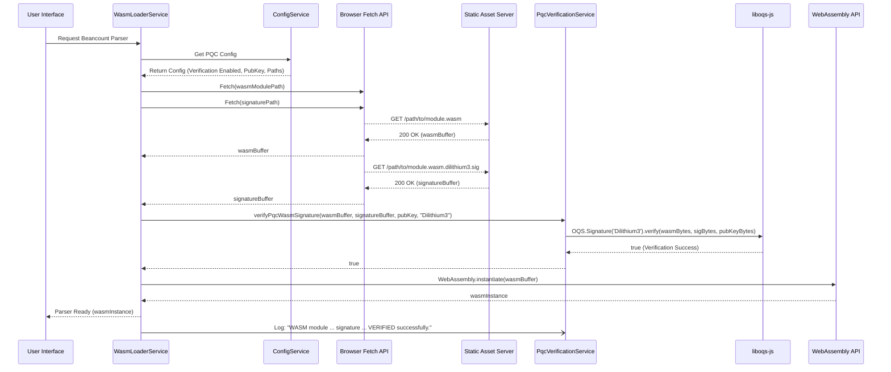
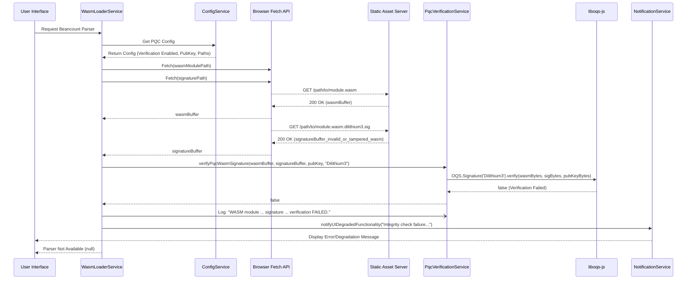
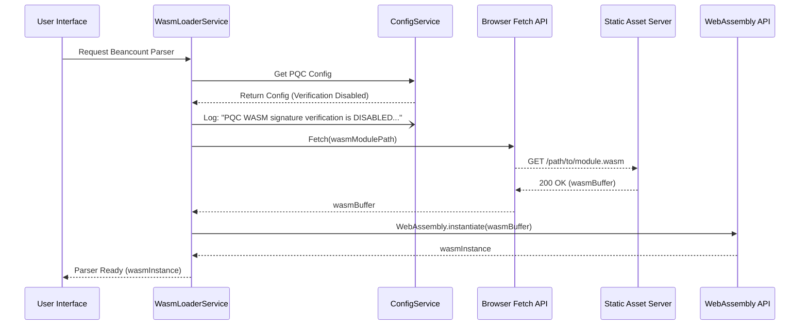

# PQC WASM Module Integrity Architecture

**Version:** 1.0
**Date:** 2025-06-02

## 1. Introduction

This document outlines the architecture for integrating Post-Quantum Cryptography (PQC) based integrity verification for WebAssembly (WASM) modules within the Fava application. Specifically, it addresses the verification of the `tree-sitter-beancount.wasm` module using the Dilithium3 PQC signature algorithm, as specified in [`docs/specifications/PQC_WASM_Module_Integrity_Spec.md`](../specifications/PQC_WASM_Module_Integrity_Spec.md) (v1.1) and detailed in [`docs/pseudocode/PQC_WASM_Module_Integrity_Pseudo.md`](../pseudocode/PQC_WASM_Module_Integrity_Pseudo.md) (v1.0).

The primary goal is to ensure that the WASM module loaded by Fava's frontend is authentic and has not been tampered with, thereby enhancing the application's overall security posture against quantum and classical threats.

This architecture supports Task 3.4 of the [`docs/ProjectMasterPlan_PQC.md`](../ProjectMasterPlan_PQC.md) and aims to fulfill the requirements for passing the high-level acceptance tests defined in [`tests/acceptance/PQC_WASM_Module_Integrity_Acceptance_Tests.md`](../../tests/acceptance/PQC_WASM_Module_Integrity_Acceptance_Tests.md).

## 2. Goals and Scope

### 2.1. Goals
*   Define a clear architectural approach for fetching, verifying, and loading the `tree-sitter-beancount.wasm` module with PQC signature verification.
*   Ensure the architecture integrates seamlessly with Fava's existing frontend structure.
*   Support the use of `liboqs-js` for Dilithium3 signature verification.
*   Provide mechanisms for clear user feedback in case of verification failure and graceful degradation of functionality.
*   Allow for configuration-based enabling/disabling of PQC verification.

### 2.2. Scope
*   Frontend architecture modifications for WASM loading and PQC verification.
*   Integration points for the PQC verification library (`liboqs-js`).
*   Interaction with sources for the WASM module and its PQC signature.
*   UI management based on the verification outcome.
*   Configuration handling for PQC WASM verification.

### 2.3. Out of Scope
*   The build process for signing the WASM module and generating the public key configuration (though the architecture assumes these artifacts are available). This is covered in the pseudocode ([`docs/pseudocode/PQC_WASM_Module_Integrity_Pseudo.md#6-build-process-stubs-conceptual---for-context-not-frontend-logic`](../pseudocode/PQC_WASM_Module_Integrity_Pseudo.md#6-build-process-stubs-conceptual---for-context-not-frontend-logic)) and specification ([`docs/specifications/PQC_WASM_Module_Integrity_Spec.md#fr21`](../specifications/PQC_WASM_Module_Integrity_Spec.md#fr21)).
*   Detailed implementation of the PQC cryptographic primitives within `liboqs-js`.

## 3. Architectural Drivers

*   **Security (FR2.1-FR2.8, NFR3.1):** Ensure the WASM module is authentic and untampered using Dilithium3.
*   **Performance (NFR3.2):** Verification should be performant (<50ms).
*   **Usability (NFR3.3, UI9.2):** Transparent on success, clear feedback on failure.
*   **Reliability (NFR3.4):** Consistent verification outcomes.
*   **Maintainability (NFR3.5):** Modular design for PQC logic.
*   **Configurability (FR2.9):** Ability to disable PQC verification.
*   **Error Handling (EC6.1-EC6.4):** Robust handling of various failure scenarios.
*   **Library Dependency (C7.1):** Reliance on `liboqs-js`.

## 4. High-Level Architecture

We will use a modular approach within the Fava frontend, introducing specific services to handle different aspects of PQC WASM module integrity.

### 4.1. C4 Model: Level 1 - System Context

```mermaid
graph TD
    User[End User] -- Interacts with --> FavaFrontend[Fava Frontend Application (Browser)]
    FavaFrontend -- Fetches WASM & Signature --> StaticAssetServer[Static Asset Server (Fava Backend or CDN)]
    StaticAssetServer -- Provides --> wasm[tree-sitter-beancount.wasm]
    StaticAssetServer -- Provides --> sig[tree-sitter-beancount.wasm.dilithium3.sig]

    subgraph Fava Build Environment (Out of Scope for Runtime Arch)
        PqcSigningTool[PQC Signing Tool (e.g., oqs-python script / liboqs CLI)]
        PrivateKey[Dilithium3 Private Key]
        PqcSigningTool -- Uses --> PrivateKey
        PqcSigningTool -- Signs --> tree_sitter_beancount_wasm_source[tree-sitter-beancount.wasm (source)]
        tree_sitter_beancount_wasm_source -- Deployed to --> StaticAssetServer
        PqcSigningTool -- Generates --> signature_file[tree-sitter-beancount.wasm.dilithium3.sig]
        signature_file -- Deployed to --> StaticAssetServer
        PqcSigningTool -- Generates/Embeds --> PqcPublicKeyConfig[PQC Public Key Config]
        PqcPublicKeyConfig -- Embedded in --> FavaFrontend
    end

    style FavaFrontend fill:#lightblue,stroke:#333,stroke-width:2px
    style StaticAssetServer fill:#lightgrey,stroke:#333,stroke-width:2px
```
**Diagram Description:** The Fava Frontend, running in the user's browser, fetches the WASM module and its PQC signature from a Static Asset Server. The build environment (separate process) is responsible for signing the WASM module and making the public key available to the frontend.

### 4.2. C4 Model: Level 2 - Container Diagram (Frontend Focus)

```mermaid
graph TD
    UserInterface[User Interface (e.g., CodeMirror Editor, Fava Views)] -- Requests Beancount Parsing --> WasmLoaderService[WasmLoaderService]
    WasmLoaderService -- Uses --> FetchAPI[Browser Fetch API]
    FetchAPI -- Fetches --> StaticAssetServer[Static Asset Server]
    StaticAssetServer -- Returns WASM & Signature --> FetchAPI
    WasmLoaderService -- Uses --> PqcVerificationService[PqcVerificationService]
    PqcVerificationService -- Uses --> LibOqsJs[liboqs-js (WASM/JS PQC Library)]
    WasmLoaderService -- Uses --> WasmInstantiationAPI[Browser WebAssembly API]
    WasmLoaderService -- Uses --> ConfigService[ConfigService (Frontend)]
    WasmLoaderService -- Notifies --> NotificationService[NotificationService (Frontend)]
    NotificationService -- Updates --> UserInterface

    subgraph FavaFrontend[Fava Frontend Application]
        UserInterface
        WasmLoaderService
        PqcVerificationService
        LibOqsJs
        WasmInstantiationAPI
        ConfigService
        NotificationService
        FetchAPI
    end

    style WasmLoaderService fill:#cyan,stroke:#333,stroke-width:2px
    style PqcVerificationService fill:#cyan,stroke:#333,stroke-width:2px
    style ConfigService fill:#cyan,stroke:#333,stroke-width:2px
    style NotificationService fill:#cyan,stroke:#333,stroke-width:2px
    style LibOqsJs fill:#orange,stroke:#333,stroke-width:2px
```
**Diagram Description:** Within the Fava Frontend, the `WasmLoaderService` orchestrates the process. It uses the `FetchAPI` to get the WASM/signature, the `ConfigService` for PQC settings, the `PqcVerificationService` (which uses `liboqs-js`) for verification, the `WebAssembly API` for instantiation, and the `NotificationService` to update the UI.

### 4.3. C4 Model: Level 3 - Component Diagram (Key Frontend Components)

```mermaid
graph TD
    subgraph WasmLoaderService [WasmLoaderService]
        direction LR
        WLS_LoadAndVerify[loadBeancountParserWithPQCVerification()]
    end

    subgraph PqcVerificationService [PqcVerificationService]
        direction LR
        PVS_Verify[verifyPqcWasmSignature()]
    end

    subgraph ConfigService [ConfigService]
        direction LR
        CS_GetConfig[getFavaPqcWasmConfig()]
    end

    subgraph NotificationService [NotificationService]
        direction LR
        NS_Notify[notifyUIDegradedFunctionality()]
    end

    subgraph LibOqsJs [liboqs-js]
        direction LR
        LOQS_Verifier[OQS.Signature('Dilithium3').verify()]
    end

    subgraph BrowserAPIs [Browser APIs]
        direction LR
        BA_Fetch[fetch()]
        BA_WasmInstantiate[WebAssembly.instantiate()]
        BA_Base64Decode[atob() / TextDecoder]
    end

    WLS_LoadAndVerify -- Fetches config from --> CS_GetConfig
    WLS_LoadAndVerify -- Calls --> BA_Fetch
    WLS_LoadAndVerify -- Calls --> PVS_Verify
    PVS_Verify -- Uses --> LOQS_Verifier
    PVS_Verify -- Uses --> BA_Base64Decode
    WLS_LoadAndVerify -- On Success, calls --> BA_WasmInstantiate
    WLS_LoadAndVerify -- On Failure/Error, calls --> NS_Notify

    style WasmLoaderService fill:#cyan
    style PqcVerificationService fill:#cyan
    style ConfigService fill:#cyan
    style NotificationService fill:#cyan
    style LibOqsJs fill:#orange
    style BrowserAPIs fill:#lightgrey
```
**Diagram Description:** This shows the key functions within each service and their interactions. `WasmLoaderService.loadBeancountParserWithPQCVerification()` is the entry point. It coordinates with `ConfigService`, `BrowserAPIs` (Fetch), `PqcVerificationService` (which uses `liboqs-js`), `BrowserAPIs` (WASM instantiation), and `NotificationService`.

## 5. Detailed Design

### 5.1. Frontend Components

#### 5.1.1. `WasmLoaderService`
*   **Responsibilities:**
    *   Orchestrate the entire process of loading and verifying the `tree-sitter-beancount.wasm` module.
    *   Fetch PQC configuration using `ConfigService`.
    *   Conditionally bypass verification if disabled via configuration (FR2.9).
    *   Fetch the WASM module and its PQC signature file concurrently using the Browser `Fetch API` (FR2.4).
    *   Invoke `PqcVerificationService` to verify the signature (FR2.5).
    *   If verification is successful, instantiate the WASM module using `WebAssembly.instantiate()` (FR2.6).
    *   If verification fails or any error occurs, prevent WASM loading and notify the UI via `NotificationService` (FR2.7, UI9.2).
    *   Handle errors related to fetching files (EC6.1, EC6.4) or missing configuration (EC6.2).
*   **Key Function (Pseudocode mapping):** `loadBeancountParserWithPQCVerification()` from [`docs/pseudocode/PQC_WASM_Module_Integrity_Pseudo.md#4-wasm-loader-integration-equivalent-to-frontendsrccodemirrorbeancountts-modifications`](../pseudocode/PQC_WASM_Module_Integrity_Pseudo.md#4-wasm-loader-integration-equivalent-to-frontendsrccodemirrorbeancountts-modifications).
*   **Location (Conceptual):** Could be part of `frontend/src/codemirror/beancount.ts` or a dedicated service `frontend/src/lib/wasmLoader.ts`.

#### 5.1.2. `PqcVerificationService`
*   **Responsibilities:**
    *   Encapsulate the PQC signature verification logic.
    *   Take the WASM module buffer, signature buffer, public key (Base64), and algorithm name as input.
    *   Decode the Base64 public key.
    *   Utilize `liboqs-js` (specifically `OQS.Signature` for Dilithium3) to perform the cryptographic verification (FR2.5).
    *   Return a boolean indicating verification success or failure.
    *   Handle errors during PQC library interaction or key decoding (EC6.2, EC6.3).
*   **Key Function (Pseudocode mapping):** `verifyPqcWasmSignature()` from [`docs/pseudocode/PQC_WASM_Module_Integrity_Pseudo.md#3-core-pqc-verification-logic-equivalent-to-frontendsrclibpqccryptots`](../pseudocode/PQC_WASM_Module_Integrity_Pseudo.md#3-core-pqc-verification-logic-equivalent-to-frontendsrclibpqccryptots).
*   **Location (Conceptual):** `frontend/src/lib/pqcCrypto.ts`.

#### 5.1.3. `ConfigService` (Frontend)
*   **Responsibilities:**
    *   Provide access to PQC-related configuration data embedded in the frontend.
    *   This includes:
        *   `pqcWasmVerificationEnabled`: Boolean flag.
        *   `pqcWasmPublicKeyDilithium3Base64`: The Base64 encoded public key.
        *   `pqcWasmSignatureAlgorithmName`: Fixed to "Dilithium3".
        *   `wasmModulePath`: Path to the WASM module.
        *   `wasmSignaturePathSuffix`: Suffix for the signature file.
*   **Key Function (Pseudocode mapping):** `GET_PQC_WASM_CONFIG_VALUES()` from [`docs/pseudocode/PQC_WASM_Module_Integrity_Pseudo.md#5-helperutility-function-stubs-conceptual`](../pseudocode/PQC_WASM_Module_Integrity_Pseudo.md#5-helperutility-function-stubs-conceptual).
*   **Location (Conceptual):** Could be a simple exported constant from a generated file (e.g., `frontend/src/generated/pqcWasmConfig.ts`) or part of a larger frontend configuration store/service.

#### 5.1.4. `NotificationService` (Frontend)
*   **Responsibilities:**
    *   Provide a centralized way to inform the user about degraded functionality if WASM loading/verification fails (UI9.2).
    *   This could involve dispatching UI events, updating a global state (e.g., in a Svelte store), or directly manipulating a notification area in the DOM.
*   **Key Function (Pseudocode mapping):** `NOTIFY_UI_DEGRADED_FUNCTIONALITY()` from [`docs/pseudocode/PQC_WASM_Module_Integrity_Pseudo.md#5-helperutility-function-stubs-conceptual`](../pseudocode/PQC_WASM_Module_Integrity_Pseudo.md#5-helperutility-function-stubs-conceptual).
*   **Location (Conceptual):** `frontend/src/lib/notifications.ts` or integrated with an existing UI notification system.

### 5.2. Data Flow / Sequence Diagrams

#### 5.2.1. Successful WASM Load & Verification (PQC Enabled)



#### 5.2.2. Failed WASM Verification (e.g., Invalid Signature)



#### 5.2.3. PQC Verification Disabled



### 5.3. Integration with `liboqs-js`

*   The `PqcVerificationService` will be responsible for interacting with `liboqs-js`.
*   It's assumed `liboqs-js` is loaded and accessible in the frontend environment (e.g., via an import or global object).
*   The service will instantiate `OQS.Signature` with the "Dilithium3" algorithm.
*   Input data (`wasmBuffer`, `signatureBuffer`) will be converted to `Uint8Array` as expected by `liboqs-js`.
*   The Base64 public key will be decoded to `Uint8Array`.
*   The `verify` method of the `liboqs-js` signature object will be called.
*   Error handling for `liboqs-js` initialization or verification failures (EC6.3) will be implemented within `PqcVerificationService` and propagated to `WasmLoaderService`.

### 5.4. Configuration Management

*   As per [`docs/specifications/PQC_WASM_Module_Integrity_Spec.md#81-pqc-wasm-verification-configuration-conceptual`](../specifications/PQC_WASM_Module_Integrity_Spec.md#81-pqc-wasm-verification-configuration-conceptual), configuration values (public key, enabled flag, paths) are expected to be available to the frontend.
*   A likely approach is to generate a TypeScript/JavaScript file (e.g., `frontend/src/generated/pqcWasmConfig.ts`) during the build process that exports these constants.
*   The `ConfigService` will provide a clean interface to access these values.

### 5.5. Error Handling and UI Feedback

*   **Fetch Failures (WASM/Signature):** `WasmLoaderService` will catch errors from `Fetch API`. Log error, notify UI via `NotificationService`, return null (FR2.7, EC6.1, EC6.4).
*   **Missing Public Key Config:** `WasmLoaderService` checks for public key. If missing, log error, notify UI, return null (EC6.2).
*   **PQC Library Init/Verify Failure:** `PqcVerificationService` handles internal errors from `liboqs-js` (e.g., unsupported algorithm, bad key format). Returns false or throws an error caught by `WasmLoaderService`. `WasmLoaderService` logs, notifies UI, returns null (EC6.3).
*   **Signature Verification Failure:** `PqcVerificationService` returns `false`. `WasmLoaderService` logs, notifies UI, returns null (FR2.7).
*   **UI Notification:** `NotificationService` will display a non-intrusive message indicating that Beancount parsing/syntax highlighting may be unavailable (UI9.2). The exact mechanism (toast, banner) will depend on Fava's existing UI patterns.

## 6. Mapping to Pseudocode and Specifications

This architecture directly maps to the structures and logic defined in the pseudocode and specifications:

*   **`WasmLoaderService`** implements the logic in `loadBeancountParserWithPQCVerification()` ([`docs/pseudocode/PQC_WASM_Module_Integrity_Pseudo.md#4-wasm-loader-integration-equivalent-to-frontendsrccodemirrorbeancountts-modifications`](../pseudocode/PQC_WASM_Module_Integrity_Pseudo.md#4-wasm-loader-integration-equivalent-to-frontendsrccodemirrorbeancountts-modifications)). It addresses FR2.4, FR2.6, FR2.7, FR2.9 and error cases EC6.1, EC6.2, EC6.4.
*   **`PqcVerificationService`** implements `verifyPqcWasmSignature()` ([`docs/pseudocode/PQC_WASM_Module_Integrity_Pseudo.md#3-core-pqc-verification-logic-equivalent-to-frontendsrclibpqccryptots`](../pseudocode/PQC_WASM_Module_Integrity_Pseudo.md#3-core-pqc-verification-logic-equivalent-to-frontendsrclibpqccryptots)). It addresses FR2.5 and error case EC6.3.
*   **`ConfigService`** provides data as per `PQC_WASM_CONFIG` ([`docs/pseudocode/PQC_WASM_Module_Integrity_Pseudo.md#2-configuration-data-conceptual`](../pseudocode/PQC_WASM_Module_Integrity_Pseudo.md#2-configuration-data-conceptual)) and Spec Section 8.1. It supports FR2.2, FR2.8, FR2.9.
*   **`NotificationService`** implements `NOTIFY_UI_DEGRADED_FUNCTIONALITY()` ([`docs/pseudocode/PQC_WASM_Module_Integrity_Pseudo.md#5-helperutility-function-stubs-conceptual`](../pseudocode/PQC_WASM_Module_Integrity_Pseudo.md#5-helperutility-function-stubs-conceptual)) and UI9.2.
*   The interaction with `liboqs-js` aligns with C7.1.
*   File fetching paths and signature naming conventions align with FR2.3 and Spec Section 8.2.

## 7. Alignment with Project Master Plan (Task 3.4)

This architecture directly supports **Task 3.4: Design Architecture for PQC WASM Module Integrity** from the [`docs/ProjectMasterPlan_PQC.md`](../ProjectMasterPlan_PQC.md):
*"Input: [`docs/pseudocode/PQC_WASM_Module_Integrity_Pseudo.md`](../pseudocode/PQC_WASM_Module_Integrity_Pseudo.md), Fava's frontend architecture.
Output: [`docs/architecture/PQC_WASM_Module_Integrity_Arch.md`](./PQC_WASM_Module_Integrity_Arch.md) (Frontend component diagrams, interaction with signature/module sources, PQC verification library (`liboqs-js`) integration).
AVER: Architecture document exists. It details the frontend components involved in fetching the WASM module and its signature, integrating the PQC verification logic, and managing the UI based on verification outcome. Reviewed and approved."*

This document fulfills the output requirement and details the necessary components and interactions as per the AVER.

## 8. Alignment with Acceptance Tests

This architecture is designed to enable passing the high-level acceptance tests in [`tests/acceptance/PQC_WASM_Module_Integrity_Acceptance_Tests.md`](../../tests/acceptance/PQC_WASM_Module_Integrity_Acceptance_Tests.md):

*   **PQC_WASM_001 (Successful Verification):** The happy path sequence diagram (5.2.1) shows successful verification and loading. The `WasmLoaderService` and `PqcVerificationService` implement this flow. Logging of success and verification time is handled by these services.
*   **PQC_WASM_002 (Invalid Signature/Tampered WASM):** The failed verification sequence (5.2.2) shows the `PqcVerificationService` returning false, leading `WasmLoaderService` to prevent loading and call `NotificationService`. Logging of failure is handled.
*   **PQC_WASM_003 (Signature File Missing):** `WasmLoaderService`'s error handling for failed fetch of the signature file covers this. It will log an error, notify the UI, and prevent loading.
*   **PQC_WASM_004 (Verification Disabled):** The verification disabled sequence (5.2.3) shows `WasmLoaderService` checking `ConfigService` and bypassing verification steps, loading the WASM module directly. Logging of disabled status is handled.

## 9. Architectural Decisions (ADRs)

### ADR 001: Modular Service-Based Approach for Frontend Logic
*   **Decision:** Implement PQC WASM integrity features using distinct frontend services (`WasmLoaderService`, `PqcVerificationService`, `ConfigService`, `NotificationService`).
*   **Rationale:**
    *   **Separation of Concerns:** Each service has a clear responsibility, improving code organization and understanding.
    *   **Maintainability (NFR3.5):** Easier to update or modify specific parts of the logic (e.g., swapping PQC library or changing config source) without impacting others.
    *   **Testability:** Individual services can be unit-tested more easily.
*   **Alternatives Considered:** Monolithic function within existing WASM loading code. Rejected due to reduced clarity and maintainability for PQC-specific logic.

### ADR 002: Use `liboqs-js` for Dilithium3 Verification
*   **Decision:** Rely on `liboqs-js` for performing the Dilithium3 signature verification.
*   **Rationale:**
    *   **Leverage Existing Library (C7.1):** Avoids implementing complex PQC cryptography from scratch.
    *   **Standard Compliance:** `liboqs` aims to implement NIST PQC standards.
    *   **Research Recommendation:** Identified as a primary option for JS/WASM PQC in [`docs/research/final_report/01_executive_summary_PART_1.md`](../research/final_report/01_executive_summary_PART_1.md) (G3.3).
*   **Alternatives Considered:** Implementing Dilithium3 verification manually (too complex and error-prone); using another PQC JS library (less mature or comprehensive options identified in research).

### ADR 003: Configuration via Build-Time Generated File
*   **Decision:** PQC WASM verification configuration (public key, enabled flag) will be provided to the frontend via a file generated at build time (e.g., `pqcWasmConfig.ts`).
*   **Rationale:**
    *   **Secure Distribution of Public Key (FR2.2):** Embedding the public key directly in the frontend bundle is a straightforward way to distribute it.
    *   **Build-time Control:** Allows easy enabling/disabling for different build profiles (dev vs. production).
    *   **Simplicity:** Avoids runtime fetching of this critical configuration, reducing complexity and potential points of failure. It is acknowledged that this approach means public key rotation requires a frontend rebuild and redeployment.
*   **Alternatives Considered:** Fetching config from a Fava API endpoint. Rejected for initial implementation to reduce complexity and dependency for this critical security feature.
*   **Future Considerations:** For enhanced agility in public key rotation, future versions could explore fetching the public key from a trusted, configurable API endpoint. This API-based approach should include robust caching mechanisms and an embedded fallback public key to maintain functionality if the API is unavailable.

## 10. Security Considerations

*   **Public Key Integrity:** The embedded public key (`pqcWasmPublicKeyDilithium3Base64`) is critical. Its integrity relies on the security of the Fava build process and distribution channel. If the frontend code itself is tampered to replace this key, this specific verification mechanism can be bypassed. This highlights the defense-in-depth nature of security.
*   **`liboqs-js` Security:** The security of the verification relies on the correctness and security of the `liboqs-js` library. Using audited and well-maintained versions is crucial.
*   **Signature File Integrity:** The signature file itself must be protected from tampering in transit. HTTPS for fetching assets is essential.
*   **Fallback Behavior:** If verification is disabled or fails, Fava operates with reduced security for WASM module integrity. This risk should be clearly communicated if verification is disabled in production (though the default is enabled).
*   **Secure Build Environment:** The process of signing the WASM module with the Dilithium3 private key is a critical step. It is paramount that the build environment where this signing occurs is secure and that the private signing key is rigorously protected against unauthorized access or disclosure. Compromise of the private key would undermine the entire integrity verification mechanism.

## 11. Performance Considerations (NFR3.2)

*   **Verification Time:** Dilithium3 verification is generally performant. The target of <50ms (NFR3.2) should be achievable with `liboqs-js`. The `WasmLoaderService` should log the verification time for monitoring.
*   **`liboqs-js` Load Time:** The size and initialization time of `liboqs-js` itself can impact overall frontend load performance. Using a custom build of `liboqs-js` with only Dilithium3 enabled is recommended to minimize bundle size (NFR3.7).
*   **Concurrent Fetching:** Fetching the WASM module and its signature concurrently helps minimize perceived latency.

## 12. Future Considerations / Maintainability

*   **Cryptographic Agility (NFR3.6):** While this architecture focuses on Dilithium3, the `PqcVerificationService` and `ConfigService` provide abstraction points. If other signature algorithms are needed, `PqcVerificationService` could be extended to support them based on `pqcWasmSignatureAlgorithmName` from the config.
*   **Public Key Rotation (FR2.8):** Updating the public key requires rebuilding the frontend with the new key in the generated config file.
*   **`liboqs-js` Updates:** Regularly updating `liboqs-js` to benefit from security patches and performance improvements will be necessary. The `PqcVerificationService` isolates this dependency.

This architecture provides a solid foundation for implementing PQC WASM module integrity in Fava, aligning with the project's specifications, pseudocode, and overall goals.