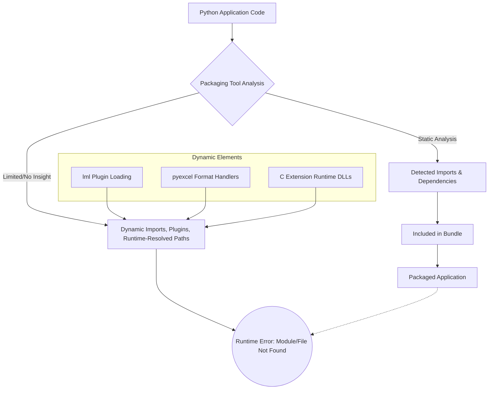

# Integrated Model: Packaging Python Applications with Complex Dependencies

This document presents an integrated model for understanding and addressing the challenges of packaging Python applications, like Fava PQC, that involve complex dependencies such as dynamic plugin systems (`pyexcel` with `lml`) and C extensions (`oqs-python`), primarily using PyInstaller, with considerations for alternatives.

## Core Challenge: Static Analysis vs. Dynamic Behavior

The central problem revolves around the limitations of static analysis tools (like PyInstaller's core mechanism) when faced with Python code that exhibits dynamic behavior at runtime.



## PyInstaller: Bridging the Gap

PyInstaller attempts to bridge this gap through several mechanisms, forming a multi-layered approach:

1.  **Static Analysis (Core):**
    *   Scans `.py` files for `import` statements.
    *   Builds an initial dependency graph.
    *   **Limitation:** Misses imports via `importlib`, `__import__()` with variable arguments, or plugin systems like `lml` that use `entry_points` or directory scanning.

2.  **Hidden Imports (`hiddenimports`):**
    *   **Purpose:** Manually informs PyInstaller of modules missed by static analysis.
    *   **Application:** Essential for `pyexcel` plugins and potentially `lml` itself or its submodules.
    *   **Challenge:** Requires knowing *all* such modules, which can be extensive for `pyexcel`.

3.  **Hooks (`hook-*.py`):**
    *   **Purpose:** Provide programmatic instructions to PyInstaller for specific packages.
    *   **Key Utilities:**
        *   `collect_submodules()`: Gathers all modules within a package, useful for plugin collections.
        *   `collect_data_files()`: Bundles non-Python data files (templates, configs).
        *   `collect_dynamic_libs()`: Bundles C extensions (.dll, .so).
        *   `copy_metadata()`: Crucial for `entry_point`-based plugin discovery (e.g., `lml`), as it copies `dist-info`/`egg-info` containing `entry_points.txt`.
    *   **Application:** The most robust way to handle `pyexcel`, `lml`, and `oqs-python`. A hook for `pyexcel` would use these to gather all its plugins, their data, and metadata. A hook for `oqs-python` would ensure `oqs.dll` and any other C dependencies are included.

4.  **Runtime Hooks (`rthook-*.py`):**
    *   **Purpose:** Execute code at the beginning of the bundled application's runtime.
    *   **Application:** Can modify `sys.path` if plugins are bundled in a way that breaks their relative import expectations, or set environment variables needed by libraries like `lml` or `oqs-python` to find their resources in the `sys._MEIPASS` temporary directory.

```mermaid
graph TD
    PyApp[Python Application] --> PyInstaller;
    PyInstaller -- Static Analysis --> DepGraph[Dependency Graph];
    PyInstaller -- User Input --> SpecFile[fava_pqc_installer.spec];
    SpecFile -- hiddenimports --> PyInstaller;
    SpecFile -- hookspath --> CustomHooksDir;
    CustomHooksDir --> HookPyexcel[hook-pyexcel.py];
    CustomHooksDir --> HookLML[hook-lml.py];
    CustomHooksDir --> HookOQS[hook-oqs-python.py];
    
    HookPyexcel -- collect_submodules, copy_metadata --> PyInstaller;
    HookLML -- collect_submodules, copy_metadata --> PyInstaller;
    HookOQS -- collect_dynamic_libs --> PyInstaller;

    PyInstaller -- Bundling Process --> FrozenApp[Frozen Application Files];
    FrozenApp -- Contains --> PyexcelCore[pyexcel Core];
    FrozenApp -- Contains --> PyexcelPlugins[pyexcel Plugins & Metadata];
    FrozenApp -- Contains --> LMLCore[lml Core & Metadata];
    FrozenApp -- Contains --> OQS_DLL[oqs.dll / .so];
    FrozenApp -- Contains --> RTHooks[Runtime Hooks];

    PackagedEXE[Packaged EXE] -- Executes --> RTHooks_Exec[Runtime Hooks Execute];
    RTHooks_Exec --> PatchedEnv[Patched Environment (sys.path, etc.)];
    PatchedEnv --> AppRuntime[Application Runtime];
    AppRuntime -- lml loads plugins --> PyexcelPlugins;
    AppRuntime -- Calls OQS --> OQS_DLL;
```

## Model for `pyexcel` and `lml`

1.  **Plugin Identification:** `lml` likely uses `entry_points` defined in the `dist-info` of `pyexcel` plugin packages (e.g., `pyexcel-xls`, `pyexcel-xlsx`).
2.  **PyInstaller Solution:**
    *   A `hook-lml.py` might be needed to ensure `lml` itself and its core components are found. `copy_metadata('lml')` is key.
    *   For each `pyexcel-*` plugin package used:
        *   `hiddenimports` for the main package (e.g., `pyexcel_xls`).
        *   `collect_submodules()` for that package.
        *   `copy_metadata()` for that package (VERY IMPORTANT for `lml` to find its `entry_points`).
        *   `collect_data_files()` if the plugin has associated data.
    *   The main `pyexcel` and `pyexcel-io` packages also need similar treatment (`hiddenimports`, `collect_submodules`, `copy_metadata`).

## Model for `oqs-python`

1.  **Dependency:** `oqs-python` is a CFFI-based wrapper around `liboqs`. The primary dependency is the compiled shared library (`oqs.dll` on Windows).
2.  **PyInstaller Solution:**
    *   A `hook-oqs.py` (or entries in the main script's spec file).
    *   `collect_dynamic_libs('oqs')` or `binaries=[('path/to/oqs.dll', '.')]` to include `oqs.dll`.
    *   Potential need to include MSVC runtime DLLs if `oqs.dll` was not built with them statically linked, though PyInstaller often handles common ones.

## Alternative Packagers (Contingency)

*   **Nuitka:**
    *   **Model:** Compiles Python to C, then to an executable. Potentially better at resolving C dependencies (`oqs-python`) and some dynamic imports due to deeper analysis.
    *   **Challenge:** Still likely needs hints for `lml`'s `entry_point` based discovery (e.g., `--include-package-data` for `dist-info` or specific Nuitka plugins if they exist). Build process is more complex.
*   **cx_Freeze:**
    *   **Model:** Similar to PyInstaller's freezing approach. Relies on `setup.py` configuration.
    *   **Challenge:** Will face similar issues with `lml` (requiring explicit `includes`) and C extensions (needing correct `include_files` for DLLs).

## Integrated Approach Summary

1.  **Prioritize PyInstaller with robust hooks.**
    *   Focus on `copy_metadata` for all `pyexcel` plugin packages and `lml`.
    *   Use `collect_submodules` for these packages.
    *   Ensure `oqs.dll` is bundled, likely via `collect_dynamic_libs` or `binaries`.
2.  **Thoroughly analyze build warnings** (PyInstaller's `warn-<appname>.txt`).
3.  **Test incrementally** in a clean environment.
4.  If PyInstaller fails despite exhaustive hook development, **evaluate Nuitka as the primary alternative**, being mindful of its build complexity but potential benefits for C extension handling.

This model provides a structured way to think about the problem and apply solutions systematically.